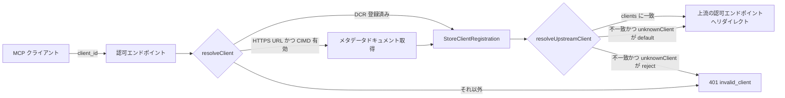

# manifold の OAuth Client ID Metadata Document (CIMD) 対応

## 背景

manifold は MCP ゲートウェイで、下流の MCP クライアントに対しては OAuth 2.1 認可サーバーとして振る舞い（`pkg/interfaces/http/auth_handler.go`）、上流のバックエンド MCP サーバーに対しては OAuth クライアントとして振る舞う（`discoverOAuth2` で DCR 登録）。

当初、下流クライアントの登録手段は RFC 7591 DCR（`POST /{server}/auth/clients`）のみだった。MCP 仕様 2026-07-28 は CIMD（`draft-ietf-oauth-client-id-metadata-document`）をクライアント登録のデフォルトにしている。CIMD では `client_id` が HTTPS URL で、その URL に JSON のクライアントメタデータが置かれる。認可サーバーはそれを取得・検証して登録なしにクライアントを受け入れる。

本書はフェーズ 1（下流 CIMD クライアントの受け入れ）とフェーズ 2（下流クライアント → 上流クライアントのマッピング）の実装後の姿を記述する。既存の DCR フローは後方互換を維持している。

## 規約

- Go、モジュール `github.com/nonchan7720/manifold`。`make test` と `make lint`（golangci-lint）を通すこと。
- 既存コードのスタイル（日本語コメント、`slog` + `util.SanitizeLog` によるログ、`trace.StartSpan`）に合わせる。
- 外部 URL の取得は `h.httpClient`（既定は `pkg/internal/client.SafeHTTPClient()`、SSRF 対策済み）を使う。新しい `http.Client` を作らない。テストからは `WithHTTPClient` で差し替える。

## 全体の流れ



## フェーズ 1: 下流 CIMD クライアントの受け入れ

### 1-1. 設定

グローバル設定として `pkg/config/oauth.go` に置く（`Config.OAuth`）。

```yaml
oauth:
  cimd:
    enabled: false            # デフォルト off（既存互換）
    allowedOrigins: []        # 空なら制限なし。指定時は client_id の origin がこのリストに含まれる必要あり
    cacheTTL: 1h              # メタデータのキャッシュ TTL 上限。Cache-Control max-age がこれより短ければそちらを優先
    maxDocumentSize: 65536    # バイト
```

`CIMDConfig.WithDefaults()` で既定値を補い、`ValidateWithContext` は `enabled: true` のときだけ検証する。`allowedOrigins` の各要素は既存の `NormalizeOrigin` で正規化・検証する。`loadInternal` に viper の `SetDefault` を登録してあるので `OAUTH_CIMD_ENABLED` などの環境変数でも上書きできる。

### 1-2. クライアント解決関数

`AuthHandler.resolveClient(ctx, clientID string) (*StoreClientRegistration, error)`（`pkg/interfaces/http/cimd.go`）。`LoginEndpoint` の store 参照はこの関数経由になっている。

解決順序:

1. `oauth_client:{clientID}` が store にあれば従来の DCR クライアントとして返す。
2. CIMD が有効で、`clientID` が以下を満たす場合のみ CIMD として扱う。満たさなければ `invalid_client`。
   - `https` スキーム
   - path が空でも `/` でもない
   - fragment なし、userinfo なし
   - ホストが IP アドレスリテラルでない、`localhost` でない
   - `allowedOrigins` が設定されていれば origin がそれに含まれる
3. `cimd_client:{sha256(clientID) の hex}` にキャッシュがあればそれを返す。
4. `h.httpClient` で GET する。`Accept: application/json`。リダイレクトは追従しない。以下を検証し、失敗したら `invalid_client`（詳細はログにのみ出す）:
   - HTTP 200
   - `Content-Type` が `application/json`（パラメータは無視）
   - ボディを `io.LimitReader` で `maxDocumentSize` に制限
   - JSON の `client_id` が要求の `clientID` と**文字列として完全一致**（正規化しない）
   - `redirect_uris` が非空で、各要素が `validateRedirectURI` を通る
   - `token_endpoint_auth_method` が未指定または `"none"`
   - `grant_types` が指定されていれば `authorization_code` を含む
5. `StoreClientRegistration` に詰めてキャッシュに保存。TTL は `Cache-Control: max-age` と `cacheTTL` の小さい方で、`no-store` / `no-cache` ならキャッシュしない。`MCPServerName` は空のままにする（CIMD クライアントはサーバー横断）。

`StoreClientRegistration.Source`（`"dcr"` / `"cimd"`）で登録経路を区別する。

クライアント起因の失敗は `errInvalidClient` でラップして返し、呼び出し側が 401 に、それ以外（store の JSON 破損など）を 500 に対応付ける。

### 1-3. LoginEndpoint

- CIMD クライアントは `MCPServerName` が空なので、`srv == nil` のときのフォールバックが成立せず `server not found`（404）になる。サーバー名を含む `/{server}/auth/login` を使う必要がある。
- `redirect_uri` の照合は `slices.Contains(clientReg.RedirectURIs, redirectURI)` の完全一致。

### 1-4. メタデータ

`MetadataEndpoint` は CIMD が有効なときだけ `"client_id_metadata_document_supported": true` を返す。

### 1-5. テスト

`httptest.Server` は loopback なので `SafeHTTPClient` に弾かれる。`WithHTTPClient` で、client_id URL のホストに関係なくテストサーバーへ差し向ける `RoundTripper` を注入してテストする（本番の既定は `SafeHTTPClient()` のまま）。

## フェーズ 2: 下流クライアント → 上流クライアントの静的マッピング

`LoginEndpoint` が下流クライアントの種別に関わらず上流に対して 1 つのクライアントを共用すると、上流の同意画面には常に manifold として表示され、上流側で同意済みセッションがあると別の下流クライアントがユーザーの同意なしに認可コードを得られる（confused deputy）。

manifold 自身は同意ページを持たない。代わりに**下流 client_id ごとに上流クライアントを設定でマッピング**し、上流 AS に登録された名前で上流の同意画面を表示させる。同意状態はクライアント単位で上流が管理するので、confused deputy は上流が防ぐ。マッピングはそのまま下流クライアントの whitelist として機能する。

### 設定

```yaml
mcpServers:
  my-backend:
    oauth2:
      authURL: https://auth.example.com/authorize
      tokenURL: https://auth.example.com/token
      scopes: [read, write]

      # 下流 client_id（CIMD URL または DCR で発行された ID）→ 上流クライアント
      clients:
        - downstreamClientID: "https://client-a.example.com/oauth-client.json"
          clientID: client-a
          clientSecret: ${CLIENT_A_SECRET}
        - downstreamClientID: "https://client-b.example.com/.well-known/oauth-client"
          clientID: client-b
          clientSecret: ${CLIENT_B_SECRET}

      # clients に無い下流クライアントの扱い。reject | default
      unknownClient: reject

      # unknownClient: default のとき使う共用クライアント（従来の挙動）
      clientID: manifold
      clientSecret: ${MANIFOLD_SECRET}

      # 上流認可リクエストに付与する追加パラメータ
      authParams:
        prompt: consent
```

- `clients` は**リスト**で、下流 client_id は要素の `downstreamClientID` フィールドに持つ。照合は完全一致（正規化しない）。同じ `downstreamClientID` を 2 回書くと validation エラー。
- `unknownClient` の実効既定値は、`clients` が非空なら `reject`、空なら `default`。`clients` を書かない既存設定は従来どおり共用クライアントで動作し、whitelist を導入した時点で fail-closed に切り替わる。
- `unknownClient` が実効的に `default` のとき `clientID` / `clientSecret` が必須。`reject` かつ `clients` 非空なら任意。
- `authParams` は `map[string]string`。設定した場合のみ `oauth2.SetAuthURLParam` で `AuthCodeURL` に渡す。manifold 自身が組み立てるパラメータ（`client_id` / `redirect_uri` / `response_type` / `scope` / `state` / `code_challenge` / `code_challenge_method`）は指定できない。
- `discoverOAuth2` による自動検出（上流が DCR 対応の MCP バックエンド）は `clients` が空のまま返るため、実効既定値により共用クライアントとして扱われる。

### `clients` を map ではなくリストにする理由

設定は viper で読んでいる。下流 client_id を YAML の map の**キー**に置くと、viper の 2 つの挙動によって元の文字列が保持できない。どちらも無効化できず、キー位置にある限り回避できない。

1. **全 map キーの小文字化** — `viper.ReadConfig` が `insensitiviseMap` を呼び、ネストした map のキーをすべて再帰的に小文字化する。無効化するオプションは無い。DCR が発行する `client_id` は大文字小文字を含むランダム文字列なので、この時点で情報が失われ復元できない。
2. **ドットでの再分割** — `AllKeys()` はネストした map をドット連結のパスに平坦化する。環境変数展開でその平坦化キーを `v.Set()` に渡すと、viper が改めてドットで分割して入れ子の map を作る。CIMD の client_id は必ずドットを含む HTTPS URL なので、1 つのキーが複数階層に割れて別物になる。

実測（修正前）:

```
clients after ReadConfig:    {"https://client-a.example.com/oauth-client.json": {...},
                              "x1xe6xpajilzj7cjyae6ja9lbzzrwc9j": {...}}
clients after expandEnvVars: {"https://client-a": {"example": {"com/oauth-client": {"json": {...}}}}}
```

`x1Xe6XPajiLzj7cjYAe6ja9LbzzrwC9J` が小文字化され、ドットを含むキーが分割されている。

リストにすると client_id は map のキーではなく**値**になる。`insensitiviseMap` はシーケンスの中には再帰せず、`AllKeys()` もシーケンスを葉として扱うため、どちらの挙動も及ばない。これにより「キーは下流 client_id の完全一致（正規化しない）」という要件がそのまま満たされる。要素内のフィールド名（`downstreamClientID` など）は小文字化されるが、mapstructure が大文字小文字を無視して対応付けるため問題ない。

副作用として、`AllKeys()` がシーケンスの中に降りないぶん、リスト要素内の `${VAR}` は展開されないままだった。`expandEnvVars` はリスト値を再帰的に walk して展開するようにしてある（`substituteEnvVars`）。展開が起きたときだけ書き戻すので、触っていない設定は viper 本来の優先順位（`AutomaticEnv` が設定ファイルに勝つ）で解決され続ける。

### `authParams` を map のままにしている理由

`authParams` も同じ経路を通るため、設定ファイルに書いたパラメータ名は小文字に正規化される。ただし OAuth 2.0 / OpenID Connect が定めるパラメータ名（`prompt`、`access_type`、`login_hint`、`max_age`、`acr_values`、`id_token_hint` など）はすべて小文字なので、実用上の問題にならない。名前を書くたびにリスト要素にする冗長さのほうが大きいと判断し、map のまま据え置いた。大文字を含む名前をどうしても使う場合は、map 全体を JSON 文字列にして環境変数から渡せば、`stringToJSONHookFunc` が `json.Unmarshal` で map を組み立てるため viper のキー処理を通らない。

### 実装

- `config.OAuth2.UpstreamClient(downstreamClientID) (OAuth2Client, bool)` がリストを完全一致で引く。
- `AuthHandler.resolveUpstreamClient(srv, downstreamClientID) (clientID, clientSecret string, err error)` が、マッピングがあればそれを、無ければ `UnknownClientMode()` に従って共用クライアントか `invalid_client` を返す。
- `LoginEndpoint` は `resolveClient` の後にこれを呼び、結果を `AuthSession.OAuth2ClientID` / `OAuth2ClientSecret` と `oauthCfg` に入れる。`CallbackEndpoint` / `TokenEndpoint` / `handleRefreshTokenGrant` は `AuthSession` / `RefreshTokenSession` に保存された上流設定を使うため変更不要。
- 拒否時のログに下流 `client_id` / `client_name` / `mcp_server_name` を出す（監査用）。
- manifold 側に「同意済みだからスキップ」する経路は無い。常に上流へリダイレクトする。

`TokenEndpoint` / `handleRefreshTokenGrant` は `resolveClient` を通していない。これらは `AuthCodeData` / `RefreshTokenSession` に記録済みの client_id と照合しており、store のクライアント登録を読んでいない。ここに解決を挟むとトークン要求ごとに外向き取得が発生しうる一方、認可コードは発行時点で解決済みのクライアントに紐づいているため、得られる保証が小さい。記録値との照合は CIMD クライアント（client_id が URL）でもそのまま機能する。

### 制約（docs に明記）

- `unknownClient: default` は上流の同意画面に manifold としてしか表示されず、confused deputy を完全には防げない。`authParams` で `prompt: consent` を付与することで軽減できるが、`prompt` は OIDC のパラメータで純 OAuth 2.0 の AS には無視されることがある。
- 本番用途では `reject` + `clients` による whitelist を推奨する。

## 未対応

- CIMD ドキュメントの `private_key_jwt` / `jwks_uri`（パブリッククライアントのみ受け入れる）。
- 上流に対する CIMD。`discoverOAuth2` はバックエンドごとに DCR しており、上流の認可サーバーメタデータに `client_id_metadata_document_supported: true` があっても manifold 自身の CIMD ドキュメントを `client_id` として使う経路は無い。導入する場合は `GET /{server}/auth/client-metadata.json` の追加と、自動検出経由で `ClientSecret` が空でも `config.OAuth2.ValidateWithContext` を通せるようにする対応が要る。
- CIMD キャッシュの明示的な無効化手段。失効したドキュメントは TTL が切れるまで有効なままになる。

## 参考

- draft-ietf-oauth-client-id-metadata-document
- MCP Authorization spec 2026-07-28（CIMD、confused deputy の節）
