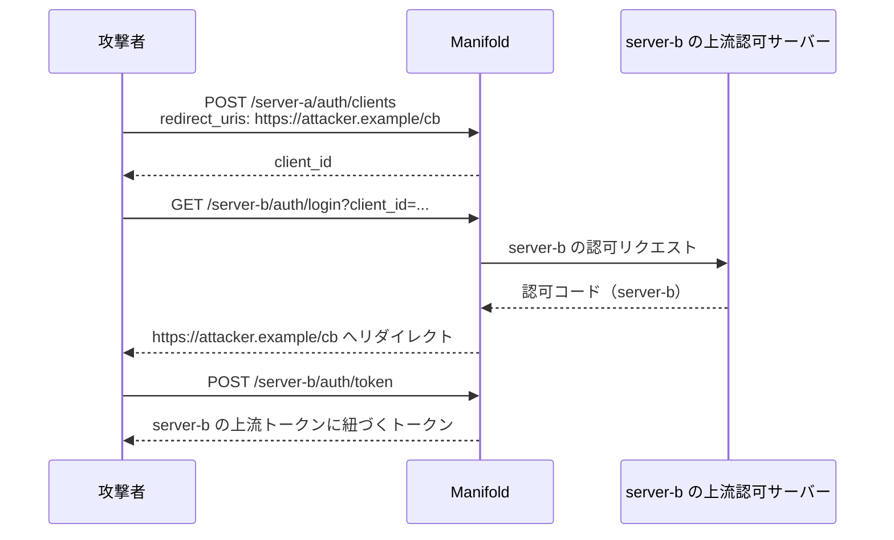

# DCR クライアントの登録元 MCP サーバーへの束縛

[English](dcr-client-server-binding.md) | 日本語

## 概要

`POST /{server_name}/auth/clients` の動的クライアント登録（RFC 7591）で発行したクライアントは、同じ MCP サーバーの認可エンドポイントでしか使えません。その `client_id` を `GET /{other_server}/auth/login` に渡すと `invalid_client`（401）で拒否されます。

クライアント ID メタデータドキュメント（CIMD）で解決したクライアントは対象外です。登録元サーバーを持たないため、従来どおり MCP サーバーを横断して使えます。

## 束縛が必要な理由

登録エンドポイントは無認証です。RFC 7591 がそう定めており、まだ何の資格情報も持たない新規クライアントに認証を要求することはできません。束縛が無いと、あるサーバーが発行した `client_id` を他のすべてのサーバーが受け入れることになり、しかも `redirect_uris` は登録者が自分で決められます。これだけで他サーバーの上流トークンを引き出せます。



登録済みの `redirect_uris` は検証されているため、これはオープンリダイレクトではありません。認可コードは登録者が申告したとおりの場所に届きます。欠けていたのは「その登録者がそもそも server-b を使ってよいのか」という確認だけです。

## 検証する内容

`LoginEndpoint` は、クライアントを解決した直後、`redirect_uri` を照合するより前に、クライアントに記録された登録元サーバーとリクエスト先のサーバー名を比較します。

| クライアントの登録経路 | 記録される `mcp_server_name` | 使える MCP サーバー |
| ---------------------- | ---------------------------- | ------------------- |
| DCR（`source: dcr`） | 登録時に記録されたサーバー | そのサーバーのみ |
| この変更より前に DCR 登録されたもの（`source` が空） | 登録時に記録されたサーバー | そのサーバーのみ |
| CIMD（`source: cimd`） | 設計上つねに空 | すべてのサーバー |

`POST /{server_name}/auth/clients` ではパスのサーバー名が記録されます。サーバー名をパスに持たない `POST /register` は、送信された `client_name` からサーバー名を取り出して記録し、束縛はそのサーバーに対して効きます。

拒否した場合は、監査用に下流の `client_id`・クライアント名・登録元サーバー名・リクエスト先のサーバー名をログへ出力します。理由をクライアントへ返すことはなく、レスポンスボディは `invalid_client` のみです。

`/authorize` エイリアスはパスにサーバー名を含みません。この経路では従来どおりクライアント自身の `mcp_server_name` からサーバーを解決するため、両者は必ず一致し、この検証で拒否されることはありません。CIMD クライアントは `mcp_server_name` を持たないので、そもそも `/authorize` では使えず `/{server_name}/auth/login` を呼ぶ必要があります。

## 影響を受ける構成

影響を受けるのは、DCR で発行した 1 つの `client_id` を複数の `mcpServers` エントリで使い回している構成だけです。そうしたリクエストは `invalid_client`（401）になります。移行方法は 2 つあります。

1. **サーバーごとに登録し直す。** クライアントに、使用する `/{server_name}/auth/clients` それぞれへ動的クライアント登録を実行させます。サーバーごとに別の `client_id` が発行され、それぞれがそのサーバーに束縛されます。MCP クライアントの通常の振る舞いであり、設定変更は不要です。

2. **明示的にマッピングする。** クライアントの識別子をサーバー間で同じに保ちたい場合は、`mcpServers.<name>.oauth2.clients` でサーバーごとに宣言し、それぞれに上流クライアントを割り当てます。

   ```yaml
   mcpServers:
     server-a:
       oauth2:
         clients:
           - downstreamClientID: "https://client.example.com/oauth-client.json"
             clientID: client-for-server-a
             clientSecret: ${SERVER_A_SECRET}
     server-b:
       oauth2:
         clients:
           - downstreamClientID: "https://client.example.com/oauth-client.json"
             clientID: client-for-server-b
             clientSecret: ${SERVER_B_SECRET}
   ```

   サーバーを横断する安定した識別子は CIMD の担当領域なので、`oauth.cimd.enabled: true` と HTTPS の `client_id` を併用してください。CIMD クライアントは登録元サーバーに束縛されず、どのサーバーが受け入れるかは `clients` と `unknownClient` で決まります。

`unknownClient` の既定値は変更していません。`clients` が非空なら `reject`、空なら `default` のままです。

## 関連

- [下流クライアントの登録](../../README_ja.md#下流クライアントの登録) — DCR・CIMD と、下流クライアントから上流クライアントへのマッピング
