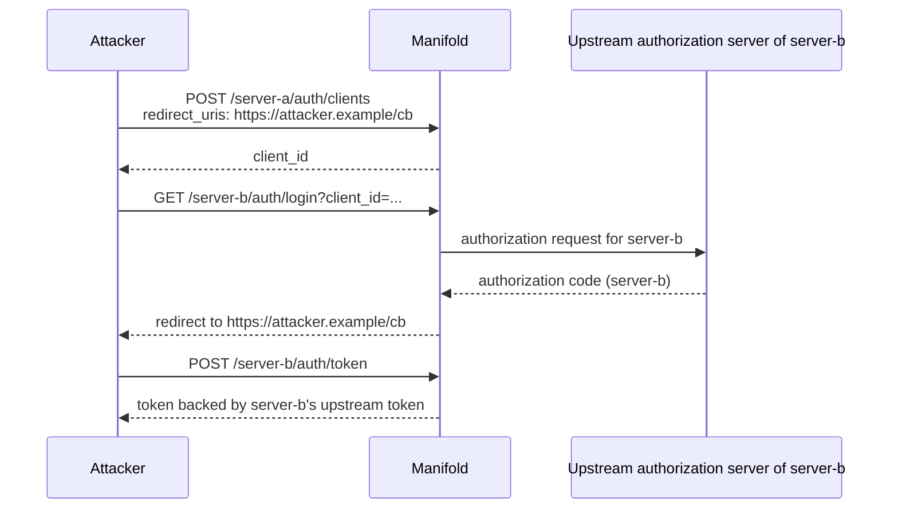

# Binding DCR Clients to the MCP Server They Registered With

English | [日本語](dcr-client-server-binding.ja.md)

## Overview

A client registered through dynamic client registration (RFC 7591) at `POST /{server_name}/auth/clients` may only use the authorization endpoint of that same MCP server. Presenting its `client_id` to `GET /{other_server}/auth/login` is refused with `invalid_client` (401).

Clients resolved through a client ID metadata document (CIMD) are not affected: they carry no registering server and stay usable across every MCP server.

## Why the binding exists

The registration endpoint is unauthenticated — that is what RFC 7591 asks for, and Manifold cannot require a credential a brand new client does not have yet. Without a binding, the `client_id` handed out by one server is accepted by every other server, and the registrant chooses its own `redirect_uris`. That is enough to pull another server's upstream tokens:



The registered `redirect_uris` are validated, so this is not an open redirect — the code lands exactly where the registrant asked. The missing piece is that nothing checked whether the registrant was ever entitled to `server-b`.

## What is checked

`LoginEndpoint` compares the registering server recorded on the client with the server named in the request, immediately after the client is resolved and before the `redirect_uri` is matched.

| Client source | Recorded `mcp_server_name` | MCP servers it may use |
| ------------- | -------------------------- | ---------------------- |
| DCR (`source: dcr`) | the server recorded at registration time | that server only |
| DCR registered before this change (`source` empty) | the server recorded at registration time | that server only |
| CIMD (`source: cimd`) | empty by design | any server |

For `POST /{server_name}/auth/clients` the recorded server is the one in the path. `POST /register` carries no server name at all and takes it from the submitted `client_name` instead; the binding then applies to that server.

A rejection logs the downstream `client_id`, the client name, the registering server name, and the requested server name for auditing. The reason is never returned to the client; the response body is `invalid_client`.

The `/authorize` alias carries no server name in its path. There, Manifold still resolves the server from the client's own `mcp_server_name`, so the two always agree and the check never rejects that route. A CIMD client has no `mcp_server_name` and therefore cannot use `/authorize` at all — it must call `/{server_name}/auth/login`.

## Configurations affected

Only setups that reuse one DCR-issued `client_id` across several `mcpServers` entries. Those requests now fail with `invalid_client` (401). Two ways to migrate:

1. **Register once per server.** Let the client run dynamic client registration against each `/{server_name}/auth/clients` it uses. Each server hands back its own `client_id`, and each is bound to that server. This is the normal MCP client behavior and needs no configuration change.

2. **Map the client explicitly.** If the client's identifier must stay the same across servers, declare it per server under `mcpServers.<name>.oauth2.clients` and give each server its own upstream client:

   ```yaml
   mcpServers:
     server-a:
       oauth2:
         clients:
           - downstreamClientID: "https://client.example.com/oauth-client.json"
             clientID: client-for-server-a
             clientSecret: ${SERVER_A_SECRET}
     server-b:
       oauth2:
         clients:
           - downstreamClientID: "https://client.example.com/oauth-client.json"
             clientID: client-for-server-b
             clientSecret: ${SERVER_B_SECRET}
   ```

   A stable cross-server identifier is what CIMD is for, so pair this with `oauth.cimd.enabled: true` and an HTTPS `client_id`. A CIMD client is not bound to a registering server, and `clients` plus `unknownClient` decide which servers actually accept it.

The default of `unknownClient` is unchanged: `reject` when `clients` is non-empty, `default` when it is empty.

## Related

- [Downstream client registration](../../README.md#downstream-client-registration) — DCR, CIMD, and the mapping from downstream to upstream clients
