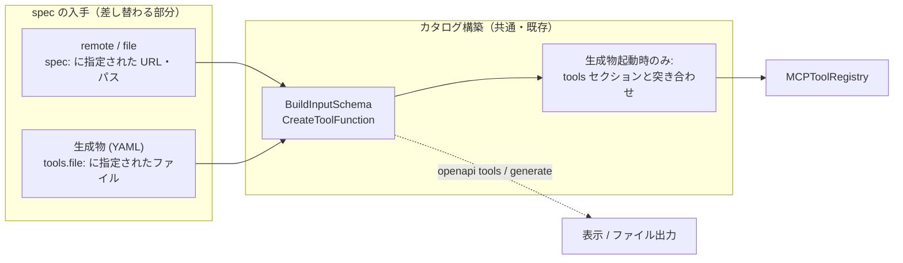

# OpenAPI 静的ツールカタログ（Phase 1）設計メモ

OpenAPI モードで「どんな MCP ツールが生成されるのか」を実行前に確認でき、その結果をファイルとして生成し、ゲートウェイに読み込ませて起動できるようにする。本書はその Phase 1 の設計と、Phase 2（Go コード生成）へ持ち越す判断事項をまとめる。

> **実装状況**: 「実装の進め方」のステップ 1〜3（入手・構築分離、`manifold openapi tools`、生成物形式・`tools.file` からの起動・`manifold openapi generate`）は先行 PR で実装済み。ステップ 4（`--check`）は後続の別 PR（本 PR）で実装済み。実装は本メモの「`--check`」節の記述と一部異なる（後述）。

## 背景と動機

現状の OpenAPI モードは次の挙動になっている。

| 項目 | 現状 |
| --- | --- |
| ツール一覧の確認手段 | ゲートウェイを起動して `GET /mcp/list?tools=true` か MCP クライアントの `tools/list` を叩くしかない。inputSchema は `tools/list` でしか見えない |
| spec の取得タイミング | 起動時 `MCPServer.Init` で全サーバー分を取得・変換する。取得や変換に失敗すると **起動自体が失敗する** |
| 更新 | `gateway.specRefresh` で定期的に取り直し、ハッシュが変わっていればツールを入れ替える |
| 変換ロジック | `pkg/internal/oastomcptool`（約 2,000 行）。multipart、ファイル URL 取得、allOf マージ、discriminator、バイナリレスポンスなど実行時の挙動が厚い |

ユーザーが欲しいのは、まず **「この spec からどんなツールが生成されるのか」が起動前に見えること**、次に **生成結果をファイルにして、それをそのまま読み込ませて動かせること** である。これが満たされると副次的に次も得られる。

- ツール名・description・inputSchema が git 上で diff でき、上流 spec の変更が PR として見える
- spec サーバーが落ちていても同じツール面で起動できる
- OPA ポリシー（`authz`）を書く相手のツール名が固定される

typed な Go 構造体が欲しい人には oapi-codegen と MCP SDK を直接使う選択肢が既にあり、Manifold が Go コード生成で差別化する余地は小さい。よって Phase 1 では **生成されるツールの可視化と、生成物からの起動** に絞る。

## スコープ

**含む**

- `manifold openapi tools`: 生成されるツール一覧を標準出力に表示する（ファイルは書かない）
- `manifold openapi generate`: 生成結果を YAML ファイルに書き出す
- `mcpServers.<name>.tools.file` によるファイルからの起動（ネットワークアクセス無し）
- `manifold openapi generate --check` による CI 上の drift 検出
- `specRefresh` との排他

**含まない（後続）**

- ツール名の変更・除外・description 上書き（overrides）。生成物を「手で編集する」形にしたくなる要望が出るはずだが、Phase 1 では生成物は機械生成のみとし、編集は config 側の overrides として別途設計する（「後続: overrides」節）
- Go コード生成、typed struct、ライブラリとしての組み込み（Phase 2）
- **Swagger 2.x**。Phase 1 は OpenAPI 3.x のみ対応する。Swagger 2.x のサーバーに `tools.file` を指定した場合は `Init` で明示的なエラーにし、`openapi tools` / `openapi generate` は対象外として警告を出してスキップする。Swagger 2.x 側は現状の `LoadSwaggerSpec` が外部 `$ref` を解決していないなど前提が異なるため、要望が出てから別途設計する

## 設計方針

**ランタイムの変換パスは変えない。** 生成物は「解決済み（外部 `$ref` を内部化した）spec + メタデータ + 導出されたツール一覧」であり、起動時はその spec を今の `BuildInputSchema` / `CreateToolFunction` にそのまま流す。新しく増えるのは「spec をどこから読むか」だけで、HTTP 実行部（`oastomcptool`）には手を入れない。



`openapi tools` と `openapi generate` は、ゲートウェイが起動時に行っているカタログ構築をそのまま呼び、結果を表示・保存するだけにする。ゲートウェイが実際に登録するものと表示されるものが必ず一致するのが狙いで、表示専用の別ロジックは作らない。

## CLI

`pkg/cmd` に `openapi` 親コマンドを追加し、`gateway` と同じ `-c` で config を読む。

### `manifold openapi tools`: 生成されるツールを見る

```bash
manifold openapi tools -c config
manifold openapi tools -c config --server petstore
manifold openapi tools -c config --server petstore --json      # inputSchema まで含めて出す
manifold openapi tools -c config --server petstore --tool getpetbyid   # 1 ツールの詳細
```

既定出力は 1 行 1 ツールの表。

```text
SERVER    TOOL             OPERATION            DESCRIPTION
petstore  addpet           POST /pet            Add a new pet to the store
petstore  getpetbyid       GET /pet/{petId}     Find pet by ID
petstore  uploadfile       POST /pet/{petId}/uploadImage   uploads an image   [binary]
```

`--json` は次節の生成物の `tools` セクションと同じ構造を JSON で出す（スクリプトや `jq` 向け。生成物そのものは YAML）。`--tool` は該当ツールの inputSchema を整形して表示する。spec の取得元は config の `spec`。`tools.file` が設定されているサーバーは、`--from-spec` を付けない限り生成物から読む（「今ゲートウェイが使うもの」を見せる）。

### `manifold openapi generate`: 生成物を書き出す

```bash
# config 内の OpenAPI モード全サーバーについて tools.file のパスへ書き出す
manifold openapi generate -c config

# 1 サーバーだけ、出力先を明示
manifold openapi generate -c config --server petstore -o ./generated/petstore.yaml

# CI: 再生成した結果とディスク上のファイルを比較し、差分があれば exit 1
manifold openapi generate -c config --check
```

処理:

1. `spec` を取得（`FetchSpecBytes`）し `source.sha256` を計算
2. 形式判定（`swagger` キーがあれば Swagger 2.x として警告しスキップ）→ ロード → `InternalizeRefs` で外部 `$ref` を内部化
3. カタログを構築して `tools` セクションを生成
4. `tools.file`（または `-o`）へ YAML で書き出す。キー順を安定させ、diff が読めるよう整形出力

`--check`:

1. 上の 1〜3 をメモリ上で実行する
2. ディスク上のファイルを読み、`source.sha256` と `tools` をそれぞれ突き合わせる。`fetchedAt` と `generatedBy` は比較対象から外す
3. 差分があれば（`source.sha256` の不一致、または `tools` の added / removed / changed のいずれか）exit 1

`tools.file` 未指定のサーバーは `--check` の対象外（動的モードのまま）。

> 実装上の補足: 当初案では `source.sha256` が一致すれば `tools` の比較を早期打ち切りしていたが、実装では常に両方比較する。`tools` の集合が同じでも `sha256` が変わっていれば drift として報告する（`spec` は `tools` セクションだけでなくランタイムのリクエスト構築 — multipart の扱いなど — にも使われるため、`tools` が同じでも spec 自体の変更は無視してよいものではない）。

## 生成物の形式

1 サーバーにつき 1 ファイル。**YAML**、拡張子は `.yaml`。config が YAML なので揃え、人が読む `tools` セクションを diff で追いやすくする。JSON は YAML のサブセットなので、生成元 spec が JSON でも同じローダーで読める。

```yaml
version: 1
generatedBy: manifold 1.12.0
source:
  spec: https://petstore3.swagger.io/api/v3/openapi.json
  sha256: "…取得した生バイト列の sha256…"
  fetchedAt: "2026-09-04T00:00:00Z"
format: openapi3
tools:
  - name: getpetbyid
    operation: GET /pet/{petId}
    description: Find pet by ID
    binaryResponse: false
    inputSchema:
      type: object
      properties:
        petId:
          type: integer
          description: ID of pet to return
      required: [petId]
spec:
  openapi: 3.0.2
  paths: { … }
  components: { … }
```

`tools` を `spec` より前に置く。ファイルを開いたときに、まず「どんなツールが生成されるか」が見え、内部化された spec は末尾に来る。

| フィールド | 役割 |
| --- | --- |
| `version` | 形式のバージョン。ローダーは未知の版を拒否する |
| `source` | 生成元の記録。`sha256` は `--check` の早期判定に使う |
| `format` | Phase 1 では `openapi3` のみ。ローダーは他の値を拒否する。将来 Swagger 2.x を足すときの拡張点として残す |
| `spec` | **ランタイムが実際に使う正本**。外部 `$ref` を内部化した状態で保存する |
| `tools` | `spec` から導出したツール一覧。**人が読むためのセクション**であり、ローダーは起動時に `spec` から再計算した結果と突き合わせ、不一致なら「生成物が古い」としてエラーにする |

`tools` は導出データなので二重化になるが、「どんなツールが生成されるか」を PR の diff で読めることが本機能の目的そのものなので、整合性検査つきで持つ（判断事項 1）。書き出しは `gopkg.in/yaml.v3` のエンコーダで行い、`inputSchema` のような `map[string]any` はキーをソートして出す（既定でソートされるが、`spec` は `openapi3.T` の JSON 化を経由するので一度 `map[string]any` に落としてから YAML 化する）。ユーザーが `tools` を手で書き換えても起動時に弾かれる。編集したい場合は後続の overrides で対応する。

### 外部 `$ref` の内部化

`openapi3.T.InternalizeRefs` を使う。ロード後の `openapi3.T` をそのままシリアライズすると `Ref` が立っている箇所は `$ref` のまま出力されるため、外部参照が残ってしまう。`InternalizeRefs` で `components` 配下へ移してから書き出す。参照名の衝突（別ドキュメントに同名スキーマがある場合）はライブラリ側の命名解決に任せるが、フィクスチャで挙動を確認しておく（判断事項 4）。

## config

```yaml
mcpServers:
  petstore:
    description: Swagger Petstore
    spec: https://petstore3.swagger.io/api/v3/openapi.json   # 生成元。tools.file 使用時もそのまま残す
    baseURL: https://petstore3.swagger.io/api/v3
    tools:
      file: ./generated/petstore.yaml                        # 指定時は起動・リフレッシュで spec を取得しない
```

| 追加フィールド | 型 | 説明 |
| --- | --- | --- |
| `tools.file` | string | 生成物のパス（ローカルのみ。URL は受け付けない） |

`tools` をオブジェクトにしておくのは、後続の overrides（`tools.exclude` など）を同じ場所に足すため。

バリデーション:

- `tools.file` は `spec` と同時指定必須。`spec` は生成元として必要であり、ファイルにも `source.spec` として記録される
- `tools.file` と `specRefreshInterval > 0` は排他。`gateway.specRefresh.interval` が設定されていても、`tools.file` を持つサーバーは `EffectiveSpecRefreshInterval` が 0 を返す
- `baseURL` の必須条件は変えない（`spec` 指定時に必須）。生成物内の `servers` からは導出しない
- `spec` が Swagger 2.x の場合、`tools.file` は指定できない。ただし config ロード時点では spec を取得しないため判定できず、実際の拒否は `Init` と `openapi generate` の形式判定で行う

## ランタイム挙動

`RegisterOpenAPI` を「spec の入手」と「カタログ構築」に分ける。入手側は 2 実装:

| 実装 | 入力 | 返すもの |
| --- | --- | --- |
| remote/file（現状） | `spec` | 形式、パース済み spec、生バイト列の sha256 |
| generated | `tools.file` | 形式、`spec` フィールドから復元した spec、生成物ファイルの sha256 |

generated 実装は生成物の `spec` を JSON に変換してから `openapi3.Loader.LoadFromData` を **外部参照禁止**（`IsExternalRefsAllowed = false`）で使い、万一内部化漏れがあればロードエラーにする。これにより生成物からの起動時にネットワークアクセスが構造的に無いことを保証する。

起動時（`Init`）:

- `tools.file` があればファイルを読み、`version` と `format`（`openapi3` のみ）を検証
- カタログを構築して `tools` セクションと突き合わせる。不一致なら `generated tools are stale for server "petstore": run "manifold openapi generate"` で起動失敗
- `specHash` には生成物ファイルの sha256 を入れる（`specRefresh` は走らないが、状態としては保持する）

`GET /mcp/list?tools=true` は変更しない。静的か動的かはカタログの利用者には関係ないため、フラグは追加しない。

## 変更箇所

| レイヤー | 変更 |
| --- | --- |
| `pkg/config/mcp.go` | `Tools.File` フィールドと上記バリデーション。`EffectiveSpecRefreshInterval` の分岐 |
| `pkg/internal/oastomcptool`（新規 `generated.go`） | 生成物の型、`Write` / `Read`、`InternalizeRefs` 呼び出し、`tools` 突き合わせ |
| `pkg/internal/mcpsrv/register_openapi.go` | 入手と構築の分離（OpenAPI 3.x 経路のみ。Swagger 2.x 経路は現状のまま）。構築結果（名前・operation・description・inputSchema・binaryResponse）を CLI からも取り出せる形で返す |
| `pkg/internal/mcpsrv/spec_refresh.go` | `tools.file` サーバーをリフレッシュ対象から外す（`EffectiveSpecRefreshInterval` 経由で自然に外れる想定。明示チェックも入れる） |
| `pkg/cmd`（新規 `openapi.go`） | `openapi tools`（`--server` / `--tool` / `--json` / `--from-spec`）、`openapi generate`（`--server` / `-o` / `--check`） |
| README / README_ja / `examples/openapi-backend` | 設定リファレンスに `tools.file` を追加。example に `openapi tools` の実行例と、`generated/` を commit して CI で `--check` を回す例を追加。example README の「初回リクエスト時に遅延取得」という記述は現状の `Init` 挙動（起動時取得）と合っていないので合わせて修正する |

## テスト戦略

- **単体**
  - 生成物: 書き出し → 読み込みで同一カタログになること（ラウンドトリップ）。httptest で外部 `$ref` を配信するフィクスチャを用意し、内部化後にネットワーク無しでロードできること
  - `tools` 突き合わせ: description・inputSchema・ツール集合それぞれの不一致を検出すること
  - `--check`: added / removed / changed の各パターン、`source.sha256` 一致時に差分なしと判定すること
  - `openapi tools`: 表出力と `--json` 出力が同じカタログから作られること（golden テスト）
  - config: `tools.file` と `specRefreshInterval` の排他、`tools.file` 単独指定の拒否
- **結合**
  - spec URL が到達不能（httptest サーバー停止）な状態で `tools.file` から `Init` が成功し、`tools/list` と `tools/call` がバックエンド（httptest）に対して動くこと
  - `openapi tools --json` の出力と、起動したゲートウェイの `tools/list` の結果が一致すること
  - Swagger 2.x の spec を持つサーバーに `tools.file` を指定すると `Init` が明示的なエラーで失敗し、`openapi generate` が警告してスキップすること
  - `specRefresh` を有効にした config で `tools.file` サーバーの refresh goroutine が起動しないこと

## 判断事項と懸念

1. **`tools` セクションを持つか**: 持つ。導出データの二重化は、起動時の突き合わせで「古い生成物」をエラーにすることで担保する。持たない案は diff が `spec` 本体の差分になり、「どんなツールが生成されるか」が読めないため不採用
2. **縮約形式にするか**: しない。`spec` をそのまま保存して既存パスに流すことで、ランタイム変更をほぼゼロに抑える。ファイルサイズは大きくなるが git 上の扱いとして許容範囲。将来 `--without-spec` のような軽量出力を検討する余地は残す
3. **`spec` を必須のままにするか**: する。「`tools.file` だけ書けば動く」方が手軽だが、生成元が config に無いと `--check` が成り立たず、再生成手順も自明でなくなる
4. **`InternalizeRefs` の命名**: 別ドキュメントに同名スキーマがある場合の衝突解決はライブラリ依存。フィクスチャで確認し、問題があれば `RefNameResolver` を差し替える
5. **秘匿情報**: spec には内部ホスト名や、稀に例として書かれたトークン様の値が含まれることがある。生成物を公開リポジトリに置く際の注意としてドキュメントに明記する
6. **Swagger 2.x**: Phase 1 では非対応。`format` フィールドを残しているので、対応するときは生成物形式を変えずに `swagger2` を足せる
7. **コマンド名**: `generate` は Phase 2 の Go コード生成と名前が重なる。Phase 2 では `generate --lang go` のようにフラグで分けるか、`codegen` を別コマンドにする。Phase 1 の時点では `generate` = YAML 生成物のみ
8. **YAML の表現**: description に複数行文字列や `#` が含まれるとき、エンコーダのクォート・ブロックスカラー選択が diff を不安定にすることがある。golden テストで代表的な spec（Petstore と、複数行 description を含む自前フィクスチャ）の出力を固定し、yaml.v3 のバージョン更新時に差分が出ないことを確認する

## 後続: overrides

生成物が見えるようになると「このツールは要らない」「名前を変えたい」が次に来る。生成物を手で編集させると `tools` 突き合わせと矛盾するため、config 側で宣言する形にする。

```yaml
    tools:
      file: ./generated/petstore.yaml
      exclude: [deletepet, "^updatepet.*"]
      rename: { getpetbyid: get_pet }
      description: { get_pet: "ID を指定してペットを 1 件取得する" }
```

適用順は exclude → rename → description。`openapi tools` と `openapi generate` の `tools` セクションは overrides 適用後の姿を出す。rename は `tools/call` の名前と OPA ポリシーの対象名を変えるため、元の operationId を `_meta.manifold.operationId` に残す。詳細設計は Phase 1 が入ってから別途起こす。

## Phase 2 へ持ち越すもの

- Go コード生成。生成するのはカタログ定義と operation メタデータのみとし、HTTP 実行部は `oastomcptool` を import させる。実際にライブラリ組み込みの要望が出てから着手する
- 生成物からの起動時に `spec` を持たずカタログだけで動くランタイム（縮約形式）。Go コード生成と同じ「実行部の分離」が前提になるため同時に検討する

## 実装の進め方

1. `RegisterOpenAPI` の入手・構築分離と、構築結果を返す API（内部リファクタのみ。挙動変更なし）
2. `manifold openapi tools`（1 の結果を表示するだけ。ここで「どんなツールが生成されるか」は見えるようになる）
3. 生成物形式・ローダー・config（`tools.file` からの起動）と `manifold openapi generate`
4. `--check`
5. README・examples・example README の遅延取得記述の修正

2 までで可視化の価値が出るので、そこで一度リリースしてもよい。
