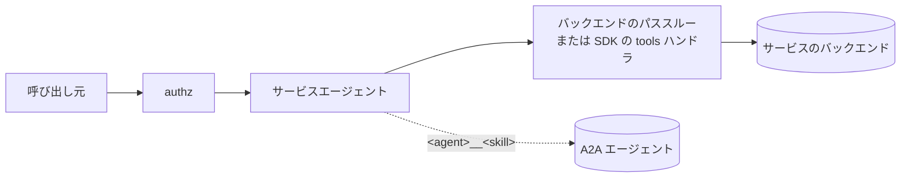

# サービスへの A2A エージェントの追加（`mcpServers.<name>.agents`）

[English](service-agents.md) | 日本語

ステータス: 承認済み

## コンテキスト

運用者は機能単位の [A2A（Agent2Agent）](https://a2a-protocol.org/)エージェントをサービスごとに定義します。たとえば請求サービスには、そのサービスの隣でしか意味を持たない翻訳エージェントとレビューエージェントがあります。トップレベルの `agents` ディレクティブは各エージェントを個別の `/mcp/<agent>` で公開しますが、この構成には合いません。`/mcp/billing` の利用者が、2 つ目・3 つ目のエンドポイントを知り、接続し、認可する必要が出てしまいます。

要望は、**サービス自体の設定方法を変えずに**、`mcpServers` のエントリへエージェントを追加することでした。以前の試みは `transport: a2a` を `mcpServers` の有効なトランスポートにするものでしたが、却下されました。目的は「エージェントを追加したサービス 1 つ」であり、サービスとエージェントを同じものにしてしまうためです。

## 決定

`mcpServers.<name>` の各エントリ（`transport: reverse` を除く）は `agents` マップを持てます。サービスはこれまでどおり `/mcp/<name>` で提供され、設定も変わりません。`tools/list` は、サービス自身のツールに、追加した各エージェントの公開スキルごとに 1 つのツールを加えて返します。

```yaml
mcpServers:
  billing:
    transport: http
    url: https://billing.example.com/mcp
    description: 請求サービス
    agents:
      translator:
        url: https://translator.example.com
        description: 翻訳に使う。
        skills: [translate]
      reviewer:
        url: https://reviewer.example.com
        description: レビューに使う。
```

### ツール名とルーティング

- スキルは `<agent>__<skill>`（アンダースコア 2 つ）、例えば `translator__translate` として公開されます。
- `__` は予約されています。エージェント名に含められず（設定の検証で拒否）、それ以外はサーバー名と同じ文字種（英数字・`_`・`-`）です。
- `tools/call` はツール名の**最初の** `__` でルーティングします。エージェント名は `__` を含めないため、一致するエージェントは高々 1 つです。追加したエージェントの `<agent>__` で始まらない名前は、これまでどおりサービスへ渡ります。
- **名前が衝突したときはサービスが優先されます。** エージェントへ振り分けられる名前と完全に同じ名前のツールをサービス自身が持つ場合（例: バックエンドのツール `translator__translate` と、スキル `translate` を持つエージェント `translator`）、呼び出しはサービスへ渡り、`tools/list` と `/mcp/list?tools=true` にはサービスのツールが 1 つだけ載り、エージェントの衝突したツールは警告ログ（`server`・`agent`・`tool`）を出して外されます。サービスのツールは絞りません。検出方法: エージェントへ振り分けられる名前の `tools/call` を受けたとき、ミドルウェアは内側のハンドラ経由でサービス自身の `tools/list`（ページングも辿る）を参照します。MCP バックエンドではエージェント呼び出し 1 回につき 1 往復余計にかかり、OpenAPI モードではプロセス内の呼び出しです。この参照に失敗したときは警告ログを出してエージェントへ渡すため、バックエンドが停止していてもエージェントの呼び出しは妨げられません。衝突の解消はエージェントの名前を変えて行います。公開していないスキル（Agent Card にない、または `skills` で除外）は、トップレベルのエージェントと同じ `unknown skill` エラーになります。
- `tools/list` と `/mcp/list?tools=true` の並び順は、サービス自身のツールが先、続いてエージェントが名前順、各エージェントのスキルは Card の順（`skills` があればその順）です。
- `skills` フィルタは、トップレベルのエージェントと同じように追加したエージェントにも適用されます。

### ミドルウェアの順序



内側から外側へ、バックエンドのパススルー（MCP バックエンド）または SDK 自身のハンドラ（OpenAPI モード）、サービスエージェントのミドルウェア、authz の順です。

- サービスエージェントのミドルウェアは、`tools/list` では先に内側のハンドラを呼び、その結果の最後（または唯一）のページにエージェントのツールを足します。内側のハンドラを包む形のため、バックエンドの live な一覧を返すパススルーを持つ MCP バックエンドでも、SDK 自身の `tools/list` ハンドラが一覧を作る OpenAPI モードでも、同じように動きます。
- `tools/call` では、追加したエージェントへ振り分けられる名前を横取りし、それ以外は内側へ渡します。
- authz が最も外側にあるため、組み立てた名前（`server=<サービス>`、`tool=<agent>__<skill>`）を見ます。同じポリシーがサービスのツールとエージェントのスキルの両方に適用され、`tools/list` は結合後の一覧に対して絞り込まれます。

### 障害とスコープ

- Agent Card を取得できないエージェントは、エラーログを出して `tools/list`（と `/mcp/list?tools=true`）から除外されます。サービス自身のツールと他のエージェントは返り、Card は次のリクエストで取り直します。起動時の取得失敗は、トップレベルのエージェントと同じく警告のみです。
- `transport: reverse` は非対応です。reverse のサーバーはユーザーごとに reverse ゲートウェイが解決し、追加したエージェントのクライアントを組み立てる `MCPServer` は関与しません。
- OpenAPI モードのサーバーは、spec リフレッシュの通知が働き続けるよう、これまでどおり `tools.listChanged: true` を広告します。spec のツールが 0 個でも tools capability は保証されます。
- 各エージェントは `headers` / `authValue` / `tokenExchange` で独立して認証します。サービスの認証は継承しません。

### 追加したエージェントでは `oauth2` を拒否する

追加したエージェントの `oauth2` は、設定のロード時に拒否されます。

```
agent "translator": oauth2 is not supported for agents under mcpServers; the OAuth flow is per server (use authValue or tokenExchange, or a top-level agents entry)
```

理由:

- Manifold の OAuth フローは**サーバー名**をキーにしています。`/mcp/<server>` の protected-resource メタデータ、`/<server>/auth/*` エンドポイント、`mcpServers.<server>.oauth2` の設定です。呼び出し元は `/mcp/<server>` への接続ごとに 1 回これを行います。
- OAuth2 の RoundTripper（`pkg/internal/client/oauth.go`）はフローを実行しません。`/mcp/<server>` への呼び出し元のリクエストに対してミドルウェア層が解決したベアラートークン（サーバー単位の上流トークン）を転送するだけで、リクエスト時に `clientID`・`authURL`・`tokenURL` を読みません。
- そのため、エージェント個別の `oauth2` ブロックは**黙って無視され**、エージェントには設定したクライアントで取得したトークンではなく、*サービスの*上流トークンが渡ります。効いているように見えて効かない設定より、ロード時に失敗させるほうが安全です。

`authValue`・`tokenExchange`・`headers` は、呼び出し元のサーバー単位のセッションに依存しないため、エージェントごとに使えます。独自の OAuth フローが必要なエージェントは、トップレベルの `agents` に書きます。トップレベルなら独自の `/mcp/<agent>` を持つため、独自のフローも持てます。

## 検討した代替案

- **`mcpServers` 配下の `transport: a2a`。** 却下（コンテキスト参照）。エージェントをサービスと同格にしてしまい、1 つのサービスに複数のエージェントを追加できません。
- **「呼び出し元のトークンを転送する」意味で追加したエージェントの `oauth2` を許可する。** 却下。設定したクライアントが無視されるため、ブロックが読み手を誤解させ、実際の認証情報の判断を隠してしまいます。
- **`<service>/<agent>` ごとに別の OAuth フローを実行する。** 当面は却下。新しい認証エンドポイント、サービスとエージェントをキーにしたトークン保存、同じ `/mcp/<service>` 接続の中での 2 回目の同意が必要になります。具体的な需要が出れば再検討でき、その際はロード時の拒否を、既存の設定を壊さずに緩められます。
- **名前が衝突したとき、サービスのツールを隠す（エージェント優先）。** 却下。エージェント名の変更は手元の設定変更で済みますが、サービスのツール名はバックエンドが決めるもので、運用者は変えられません。そのためサービスのツールを到達可能なまま残し、外すのはエージェントの衝突したスキルの側にします。
- **別の区切り文字や、エージェントごとのツール接頭辞オプション。** 却下。予約する区切りを 1 つにし、設定項目を増やさないことで、規則を単純に、ルーティングを曖昧さのないものに保ちます。

## 影響

- 設定検証のエラー: `agents is not supported for the reverse transport`、エージェント名の不正な文字、``agent name "x" must not contain "__"``、上記の `oauth2` のエラー、エージェント名を付けたエージェント単位の検証エラー。`agentCardPath` と `skills` は `mcpServers` エントリ直下では引き続き拒否され（`... is only supported under agents`）、追加したエージェントの中に書きます。
- ツール名に `<agent>__` の接頭辞が付くため、authz ポリシーはその名前を使う必要があります。
- エージェント名はサービスごとに独立しており、別のサービスと重複しても、トップレベルの名前と同じでも構いません。
- ドキュメント: README の「サービスにエージェントをぶら下げる」と `mcpServers.<name>.agents.<agent>` の節。
- テスト: `pkg/internal/mcpsrv/service_agents_test.go`（一覧・ルーティング・OpenAPI モード・取得不能な Card・authz・capabilities）と `pkg/config/agent_test.go`（検証と読み込み）。
