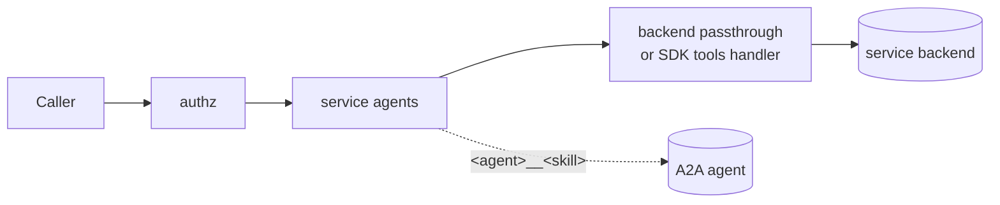

# Attaching A2A Agents to a Service (`mcpServers.<name>.agents`)

English | [日本語](service-agents.ja.md)

Status: accepted

## Context

Operators define function-level [A2A (Agent2Agent)](https://a2a-protocol.org/) agents per service: a billing service has a translation agent and a review agent that only make sense next to it. The top-level `agents` directive publishes each agent at its own `/mcp/<agent>`, which does not fit that layout — callers of `/mcp/billing` would have to know about, connect to and authorize a second and third endpoint.

The request was to attach agents to an `mcpServers` entry **without changing how the service itself is configured**. An earlier attempt made `transport: a2a` a valid `mcpServers` transport. That was rejected: it turns the service and the agent into the same thing, when the goal is one service with agents attached to it.

## Decision

Each `mcpServers.<name>` entry (except `transport: reverse`) may carry an `agents` map. The service stays served at `/mcp/<name>`, configured as before. Its `tools/list` returns the service's own tools plus one tool per exposed skill of each attached agent.

```yaml
mcpServers:
  billing:
    transport: http
    url: https://billing.example.com/mcp
    description: Billing service
    agents:
      translator:
        url: https://translator.example.com
        description: Use for translation.
        skills: [translate]
      reviewer:
        url: https://reviewer.example.com
        description: Use for review.
```

### Tool naming and routing

- A skill is exposed as `<agent>__<skill>` (double underscore), e.g. `translator__translate`.
- `__` is reserved: an agent name may not contain it (config validation rejects it), and must otherwise match the server-name characters (alphanumerics, `_`, `-`).
- `tools/call` is routed on the **first** `__` of the tool name. Because agent names cannot contain `__`, at most one agent matches. A name that does not start with an attached agent's `<agent>__` goes to the service as before.
- **On a name collision the service wins.** If the service itself has a tool with the exact name that would route to an agent (e.g. a backend tool `translator__translate` next to agent `translator` with skill `translate`), the call goes to the service, and `tools/list` / `/mcp/list?tools=true` list the service's tool once and drop the agent's colliding tool with a warning log (`server`, `agent`, `tool`). The service's tools are never filtered. Detection: on a `tools/call` whose name would route to an agent, the middleware consults the service's own `tools/list` (following pagination) through the inner handler, so it costs one extra round trip per agent call for MCP backends and an in-process call for OpenAPI mode. If that lookup fails, a warning is logged and the call goes to the agent, so an unavailable backend never blocks agent calls. The remedy for a collision is to rename the agent. A skill that is not exposed (Agent Card does not have it, or `skills` excludes it) yields the same `unknown skill` error as for a top-level agent.
- Order in `tools/list` and `/mcp/list?tools=true`: the service's own tools first, then the agents in name order, each agent's skills in card order (or `skills` order).
- The `skills` filter applies to nested agents exactly as it does to top-level agents.

### Middleware ordering



Inside to outside: backend passthrough (MCP backends) or the SDK's own handler (OpenAPI mode), then the service-agents middleware, then authz.

- The service-agents middleware calls the inner handler first on `tools/list` and appends the agent tools to the last (or only) page. Because it wraps the inner handler, this works the same for MCP backends, where the passthrough returns the backend's live list, and for OpenAPI mode, where the SDK's own `tools/list` handler produces the list.
- On `tools/call` it intercepts names that route to an attached agent and forwards everything else inward.
- Authz is outermost, so it sees the composed names: `server=<service>`, `tool=<agent>__<skill>`. One policy governs the service's tools and its agents' skills, and `tools/list` is filtered over the merged list.

### Failure and scope

- An agent whose Agent Card cannot be fetched is skipped from `tools/list` (and `/mcp/list?tools=true`) with an error log. The service's own tools and the other agents are still returned; the card is fetched again on the next request. At startup a failed fetch only warns, as for top-level agents.
- `transport: reverse` is not supported. Reverse servers are resolved per user by the reverse gateway, not by `MCPServer`, which is what builds the nested agent clients.
- OpenAPI-mode servers advertise `tools.listChanged: true` as before so spec refresh notifications keep working, and the tools capability is guaranteed even if the spec yields no tools.
- Each agent authenticates independently with `headers` / `authValue` / `tokenExchange`. These are not inherited from the service.

### `oauth2` is rejected for nested agents

Nested agents reject `oauth2` at config load:

```
agent "translator": oauth2 is not supported for agents under mcpServers; the OAuth flow is per server (use authValue or tokenExchange, or a top-level agents entry)
```

Why:

- Manifold's OAuth flow is keyed by the **server name**: the protected-resource metadata of `/mcp/<server>`, the `/<server>/auth/*` endpoints, and the `mcpServers.<server>.oauth2` settings. A caller performs it once per `/mcp/<server>` connection.
- The OAuth2 round tripper (`pkg/internal/client/oauth.go`) does not run a flow. It forwards the bearer token that the middleware layer resolved for the caller's request to `/mcp/<server>` — the per-server upstream token — and never reads `clientID`, `authURL` or `tokenURL` at request time.
- An agent-level `oauth2` block would therefore be **silently ignored**, and the agent would receive the *service's* upstream token instead of one obtained with the configured client. Failing at load time is safer than a configuration that looks effective and is not.

`authValue`, `tokenExchange` and `headers` stay available per agent because they do not depend on the caller's per-server session. An agent that needs its own OAuth flow is configured as a top-level `agents` entry, which has its own `/mcp/<agent>` and therefore its own flow.

## Alternatives considered

- **`transport: a2a` under `mcpServers`.** Rejected (see Context). It makes an agent a peer of the service and cannot attach several agents to one.
- **Allow `oauth2` on nested agents with "forward the caller's token" semantics.** Rejected: the configured client would be ignored, so the block would mislead readers and hide a real credential decision.
- **Run a separate OAuth flow per `<service>/<agent>`.** Rejected for now. It needs new auth endpoints, token storage keyed by service and agent, and a second consent step inside the same `/mcp/<service>` connection. It can be revisited if a concrete need appears; the load-time rejection can then be relaxed without breaking configurations.
- **On a name collision, hide the service's tool (agent wins).** Rejected: renaming an agent is a local configuration change, whereas a service's tool names are owned by its backend and cannot be changed by the operator. The service therefore keeps its tools reachable, and the agent's colliding skill is the one dropped.
- **A different separator or a per-agent tool prefix option.** Rejected to keep the rule simple and routing unambiguous: one reserved separator, nothing to configure.

## Consequences

- Config validation errors: `agents is not supported for the reverse transport`; invalid agent name characters; ``agent name "x" must not contain "__"``; the `oauth2` error above; and per-agent validation errors wrapped with the agent name. `agentCardPath` and `skills` remain rejected directly on an `mcpServers` entry (`... is only supported under agents`); they belong inside the nested agent.
- Tool names gain the `<agent>__` prefix, so authz policies must use those names.
- Agent names are scoped to the service: they may repeat across services and may equal a top-level name.
- Documentation: README sections "Attaching agents to a service" and `mcpServers.<name>.agents.<agent>`.
- Tests: `pkg/internal/mcpsrv/service_agents_test.go` (listing, routing, OpenAPI mode, unreachable card, authz, capabilities) and `pkg/config/agent_test.go` (validation and loading).
