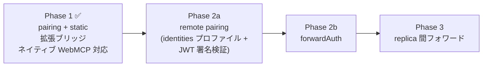
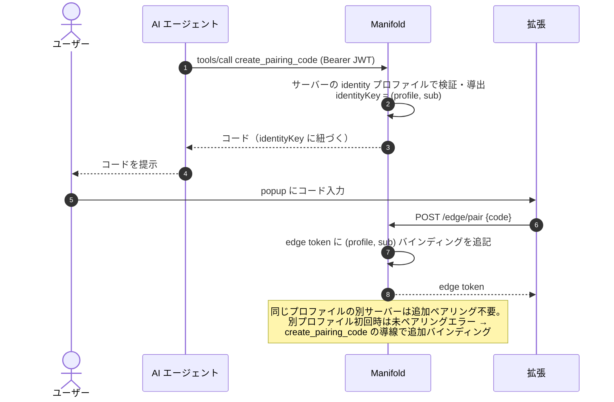
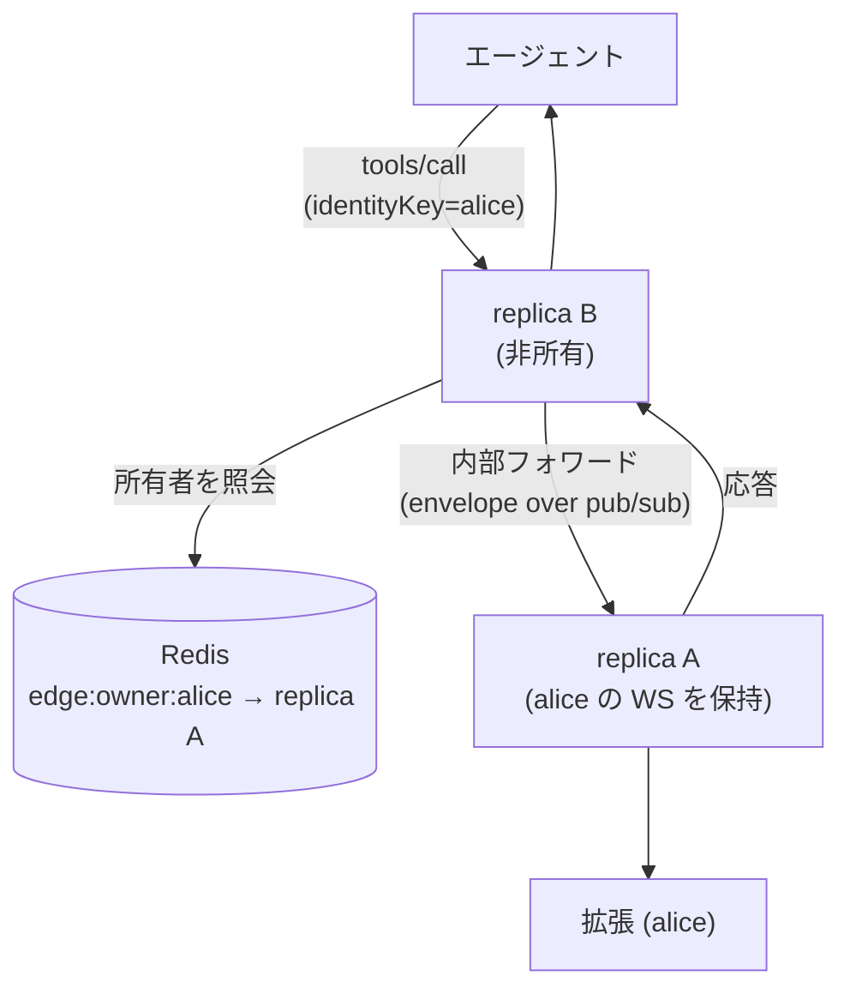

# WebMCP Reverse Gateway 次フェーズ計画

Phase 1（pairing + static）の設計は [webmcp-reverse-gateway.ja.md](webmcp-reverse-gateway.ja.md) を正本とする。本書はその後続フェーズの実装計画と、Phase 1 で保留した判断事項をまとめる。

## 現在地とロードマップ

Phase 1 は PR #100 として実装済み。デモページ（@mcp-b/global）と実アプリ（React + insecure context + 遅延初期化）の両方で、ペアリング → タブブリッジ → MCP クライアントからのツール呼び出しまで実環境で検証済み。

順序の根拠: 2a の identities プロファイルは 2b（forwardAuth のハンドシェイク時導出）と 3（identityKey ベースの所有権管理）の前提になるため最初に実装する。

## Phase 2a: remote pairing

マルチユーザー環境で、エージェントごとの identityKey にペアリングを紐づける。Phase 1 で config 構造のみ受け入れて拒否している `pairing.type: remote` を有効化する。

### identities プロファイルの実装

設計は正本文書の「ユーザー識別（identity プロファイル）」の通り。実装対象は 3 source:

| source | 実装内容 | 主な考慮点 |
| --- | --- | --- |
| `jwt` | Bearer JWT の署名検証（issuer / JWKS / audience）→ claim 抽出 | reverse ではトークンを転送するバックエンドが無く **Manifold が検証の終端**。既存 `/mcp` JWT ミドルウェア（パススルー）とは役割が別物であることをコードでも分離して表現する |
| `header` | ヘッダー値の抽出（`hash: true` で HMAC） | HMAC 鍵は `gateway.encryptKey` から導出。ローテーションするキーへの `hash: true` はドキュメントで禁止 |
| `introspection` | 外部 endpoint への問い合わせ + TTL キャッシュ | singleflight で同一クレデンシャルの問い合わせを併合。endpoint 障害時は「キャッシュがあれば継続、無ければ 503」 |

ライブラリ: JWT 検証は `github.com/golang-jwt/jwt/v5`（既に依存グラフに間接依存として存在）を第一候補、JWKS 取得・キャッシュは `github.com/MicahParks/keyfunc` を候補とする。`lestrrat-go/jwx` に一本化する案もあり、実装着手時にどちらかへ確定する（自作はしない）。

### ペアリングのプロファイル対応

### 変更箇所

| レイヤー | 変更 |
| --- | --- |
| `pkg/config` | `identities:` セクションの型・バリデーション（jwt は issuer/jwksURL 必須、参照整合性）。`pairing.type: remote` の拒否を解除 |
| `pkg/services`（新設 identity パッケージ） | プロファイル解決器（source 別実装 + キャッシュ）。`IdentityKeyForRequest` の remote 分岐を実装 |
| `pkg/services/edge` | edge token の**複数バインディング**対応（static は固定キー 1 個の縮退ケースとして統合）。未ペアリングプロファイルのエラー導線 |
| `pkg/internal/mcpsrv` | `resolveMCPServer` / ReverseGateway の per-identityKey ルーティング（構造は Phase 1 のまま、キー導出だけ差し替え） |
| 拡張 | 変更ほぼ不要（ペアリングフローは同一）。エラーメッセージの文言確認のみ |

### テスト戦略

- 単体: 各 source の導出（正常 / 検証失敗 / ローテーション跨ぎの安定性）、バインディング追記、プロファイル間の分離（他人の identityKey に到達できないこと）
- 結合: httptest + 自前 JWKS サーバーで「2 ユーザー × 2 プロファイル」のルーティング分離を検証
- E2E: webmcp-e2e スキルに remote モードのシナリオを追加（Manifold の内蔵 OAuth をトークン発行元に使う）

## Phase 2b: forwardAuth

設計は正本文書の「forwardAuth モード」の通り。2a のプロファイル解決器を WS ハンドシェイクのヘッダーに適用するだけなので、実装量は小さい。

- `edge.auth: forwardAuth` の拒否解除、`edge.identities`（ハンドシェイクから導出を試みるプロファイル列挙）の実装
- first-message `auth` フレームの `token` 省略許可（ハンドシェイクで認証済みのため）
- 検証は Traefik forwardAuth 構成の compose 例を examples に追加して行う
- ドキュメントに信頼境界（前段がクライアント由来ヘッダーを除去する責務、edge への直接到達遮断）を利用者向けに転記

## Phase 3: replica 間フォワード

v1 の「単一 replica またはスティッキー LB 前提」を解除する。

- EdgeRegistry インターフェース（Phase 1 で切り出し済み）の Redis 実装を追加: `edge:owner:{identityKey}` を heartbeat 付き TTL で保持、pub/sub チャネルでリクエスト/レスポンスを中継
- 所有 replica のダウン時は所有権 TTL 切れ → 拡張の自動再接続で新 replica が所有権を取得
- フォワード分のレイテンシと、pub/sub のメッセージサイズ上限（大きなツール結果）は実装時に計測して方式を確定する（必要なら中継を Redis Streams か直接 HTTP 内部呼び出しに変更）

## Phase 1 からの持ち越し判断事項

| # | 論点 | 推奨 | 状態 |
| --- | --- | --- | --- |
| 1 | WS チャネル満杯時に MCP フレームを drop する現挙動 | **現状維持**。ブロッキングは単一 binding の詰まりが同一接続の全 binding を止める。呼び出し側は callTimeout で失敗が返る。将来、per-binding のバックプレッシャが必要になったら Phase 3 の中継設計と合わせて再検討 | 承認待ち |
| 2 | jwt プロファイルのフェーズ区分（正本文書が Phase 1 に読める） | **本書で Phase 2a と明確化**（正本文書の識別セクションに「実装は Phase 2a」の注記を追加する） | 本書で解消 |
| 3 | static モード時の bind アドレス（全インターフェース） | **警告もバリデーションも追加しない**。コンテナ/k8s では 0.0.0.0 が正常であり画一的警告は誤検知になる。「static はローカル専用。公開ネットワークに晒さない」を README / 正本文書の static 節に明記する対応のみ | 承認待ち |
| 4 | ペアリングコードの総当たり対策 | remote 実装（2a）に含める: `/edge/pair` に IP 単位のレート制限（既存 store ベースの固定窓カウンタ）+ 失敗 N 回でコード無効化。コード空間は現行 8 桁を維持し、5 分 TTL・一回限りと組み合わせて総当たり成立時間 >> TTL を担保 | 2a のスコープに編入 |

## 拡張側の残改善（フェーズ非依存、随時）

- `edgeUrl` の検証: リモートは `wss:` 必須、`ws:` は loopback のみ許可（レビュー指摘 #17）
- `transport.start()` / `send()` 失敗時のクリーンアップ共通化（同 #15）
- 連続 `ready` 受信時の content script sync 直列化（同 #14）
- popup の接続状態ライブ更新（現状は開き直しで反映）
- `host_permissions` の絞り込み（`chrome.permissions.request` による実行時要求）
- ネイティブ WebMCP でツール**削除**が反映されない制約の解消（`@mcp-b/webmcp-ts-sdk` の backfill 仕様依存。上流の改善提案も検討）

## 実装の進め方

1. Phase 2a を「config + identity 解決器」「pairing/edge token の複数バインディング」「ルーティング + 総当たり対策」の 3 PR 程度に分割（すべてテストファースト）
2. 2a 完了時点で webmcp-e2e スキルに remote シナリオを追加し、リグレッション検知を自動化
3. 2b は 2a の直後に小さく。3 は需要（マルチ replica デプロイの具体化）が出た時点で着手
