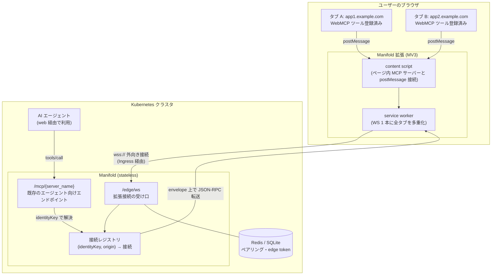
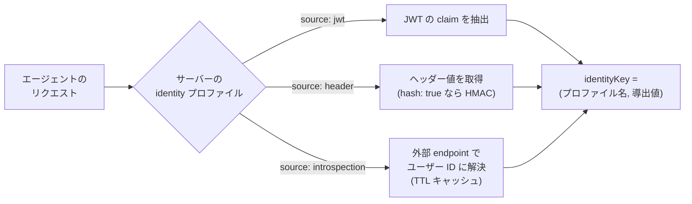
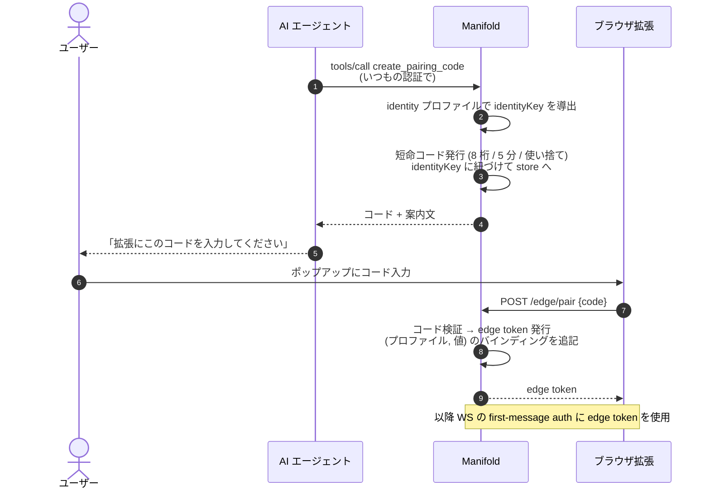
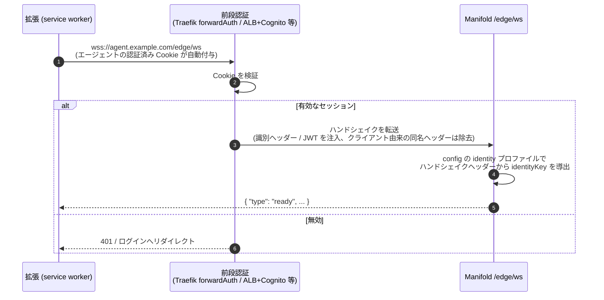
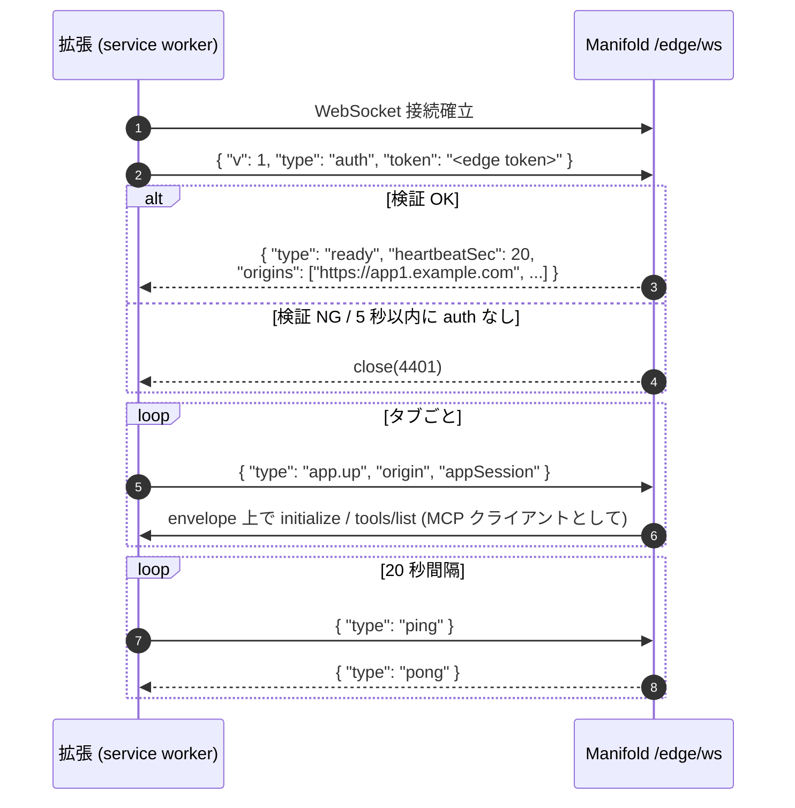
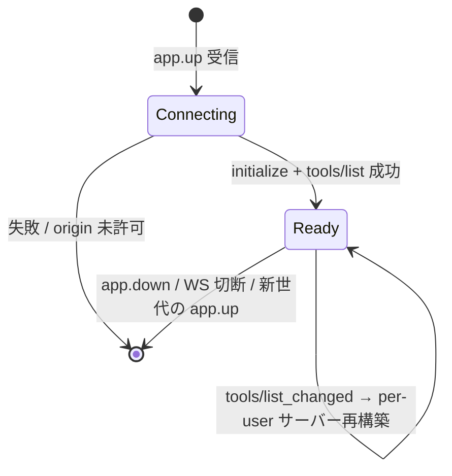
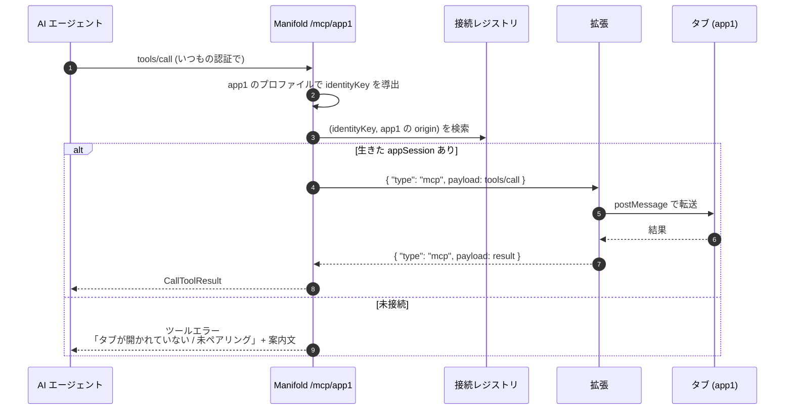

# WebMCP Reverse Connection Gateway 設計

[English](webmcp-reverse-gateway.md) | 日本語

## 概要

Web ページが [WebMCP](https://webmachinelearning.github.io/webmcp/)（`document.modelContext`。`navigator.modelContext` は非推奨エイリアス）で登録するツールを、Manifold を経由してサーバーサイドの AI エージェントから呼び出せるようにする。

WebMCP のツールはユーザーのブラウザのタブ内（ログイン済みの Web アプリの JS 実行環境）に存在する。サーバー側からタブへ接続することはできないため、**ブラウザ拡張が Manifold へ外向きに WebSocket を張り、その確立済みチャネル上で役割を逆転させる**（ページ側が MCP サーバー、Manifold が MCP クライアント）。これを reverse connection と呼ぶ。



接続を張る方向（ブラウザ → Manifold）と MCP の役割（ページ = サーバー、Manifold = クライアント）は独立している。エージェントはブラウザと直接通信せず、常に Manifold を rendezvous point として経由するため、エージェントの稼働場所（k8s 内・ローカル問わず）はこの方式に影響しない。

## 設計上の決定事項

| 論点 | 決定 | 理由 |
| --- | --- | --- |
| ツールへの到達方法 | ブラウザ拡張による reverse connection | OSS として任意の WebMCP 実装サイトに対応するため（サイト側への JS 追加を要求しない）。サーバーサイド Chrome 群の運用（per-user プロセス管理・対象アプリへの認証注入）を丸ごと回避できる |
| アプリの識別 | origin 単位。config に明示宣言 | 許可リストを兼ねる。エージェントから見えるサーバー名が安定する |
| ユーザーの識別 | identity プロファイル（サーバーごとに参照） | エージェント → Manifold の認証方式がデプロイ・サーバーごとに異なる（内蔵 OAuth 2.1 / 共有 API Key + ユーザーヘッダー / 個別 API Key）ため |
| 拡張との紐づけ | edge 認証モード（`pairing` / `forwardAuth`）を選択 | 既定はエージェントの認証方式に非依存なペアリングコード方式。前段の認証基盤（Traefik forwardAuth / ALB + Cognito 等）がある環境では、エージェントの認証済み Cookie をそのまま使う forwardAuth モードでペアリングを省略できる |
| 制約 | 対象アプリのタブが開いていないとツールは呼べない | 仕様として許容する。未接続時はエージェントがユーザーに案内できるエラーを返す |

## ユーザー識別（identity プロファイル）

エージェント → Manifold の認証はデプロイやサーバーごとに異なるため、「リクエストから誰かを割り出す方法」を名前付きプロファイルとして定義し、reverse サーバーごとに参照する。identities プロファイルの実装は Phase 2a（[次フェーズ計画](webmcp-reverse-gateway-phase2.ja.md)）のスコープであり、Phase 1（static）では使用しない。

identityKey は **(プロファイル名, 導出値)** のタプル。identityKey に要求される性質は次の 2 つ:

1. **ユーザーごとに一意**であること
2. **クレデンシャルのローテーションを跨いで安定**であること

既存の `/mcp/{server_name}` の JWT ミドルウェアは意図的な**パススルー**（非空の Bearer の存在確認のみ）であり、トークンの検証はバックエンドの API / MCP サーバーの責務としている。reverse ではトークンを転送するバックエンドが存在せず **Manifold が検証の終端**になるため、`jwt` プロファイルは Manifold 自身による署名検証（issuer / JWKS / audience）を必須とする。また `pairing.type: static` の reverse サーバーでは、転送先が無い以上パススルーの Bearer 存在チェックにも意味が無いため、JWT ミドルウェア自体を適用しない。

```yaml
identities:
  oauth:
    source: jwt
    claim: sub                  # トークンは短命でも sub は安定
    issuer: https://idp.example.com
    jwksURL: https://idp.example.com/.well-known/jwks.json
    audience: manifold          # 任意
  sharedKeyUser:
    source: header
    header: X-User-Id           # ユーザー ID そのもの
  rotatingKey:
    source: introspection       # ローテーションする opaque key 用
    url: https://agent-platform.example.com/introspect
    credentialHeader: X-Api-Key
    cacheTTL: 5m
  personalKey:
    source: header
    header: X-Api-Key
    hash: true                  # 生値を保持せず HMAC を識別キーにする
```

| source | 導出方法 | ローテーション耐性 |
| --- | --- | --- |
| `jwt` | Bearer JWT を**署名検証（issuer / JWKS / audience）した上で**指定 claim（既定 `sub`）を抽出 | ○（トークン更新でも claim は安定） |
| `header` | 指定ヘッダーの値。`hash: true` で HMAC 化 | ヘッダーの値が安定な場合のみ ○。`hash: true` はローテーションしないキー専用 |
| `introspection` | 指定ヘッダーの値を外部 endpoint に問い合わせ、安定したユーザー ID に解決（TTL キャッシュ） | ○（解決後の ID が安定なため） |



### サポート外の構成

ローテーションする opaque key のみで、安定した識別子がリクエストのどこにも無く、introspection 先も用意できない場合は原理的に突合不可能であり、サポート外とする（どの設計でも解けない）。

### 信頼境界

`source: header`（`X-User-Id` 型）は「共有 API Key を持つ者は任意のユーザー ID を名乗れる」ところで信頼が止まる。Manifold 側では検証できず、エージェント基盤がヘッダーを正しく付与することを信頼する。この制約は利用者向けドキュメントに明記する。

## 拡張と identity の紐づけ（edge 認証モード）

拡張の接続を identityKey に紐づける方法は 2 モードあり、デプロイごとに config で選択する。

| モード | 想定環境 | 紐づけ方法 |
| --- | --- | --- |
| `pairing` + `type: remote`（既定） | マルチユーザー、前段認証なし | identity プロファイルで導出したキーに対し、ペアリングコードで edge token を発行し first-message 認証に使う |
| `pairing` + `type: static` | ローカル・単一ユーザー（Claude Code / Codex 等の CLI エージェント） | identityKey は固定値。ただしペアリング手順と edge token は省略しない（無設定で繋がる経路は作らない） |
| `forwardAuth` | マルチユーザー + 前段の認証基盤（Traefik forwardAuth / oauth2-proxy / ALB + Cognito / Cloudflare Access 等）が edge エンドポイントを保護している | WS ハンドシェイクに乗るエージェントの認証済み Cookie を前段が検証し、識別ヘッダー / JWT に変換して Manifold へ渡す。ペアリング不要 |

どのモードでも、拡張の WS 接続が**認証なしで受理されることはない**（pairing 系は edge token、forwardAuth は前段による認証済みハンドシェイク）。

### pairing モード

拡張はエージェントの認証方式を知らない。エージェントの**認証済みチャネル自体**を使って identity を拡張へ継承する（Device Authorization Grant と同じ発想）。



- `create_pairing_code` は各 reverse サーバーの組み込みツール。呼ばれた時点の**そのサーバーのプロファイル**で identityKey を導出してコードに紐づける
- edge token は複数のバインディング **(プロファイル, 値)** を保持できる。同じプロファイルを参照するサーバー同士はペアリング 1 回で済む
- 別プロファイルのサーバーを初めて使うときは、未ペアリングエラーの導線で追加ペアリングが走る
- edge token: 長命・sliding TTL・拡張からのログアウトおよびサーバー側で失効可能。既存の store（Redis / SQLite）で管理
- コード: 短命（5 分）・一回限り・レート制限付き

#### type: static（単一ユーザー）

ローカルで Claude Code / Codex 等の CLI エージェントに使わせる構成向け。エージェントのリクエストに JWT も API Key も無いことがあり、identity プロファイルで導出するものが存在しないため、identityKey を固定値にする。

- `create_pairing_code` は identity 導出を行わず、固定 identityKey に紐づくコードを返す。ペアリングの手順・edge token の要求は remote と同一
- reverse サーバーの `identity` 参照は不要（指定されていても使われない）
- reverse サーバーへの `/mcp/{name}` リクエストには JWT ミドルウェアを適用しない（パススルー転送先が存在しないため。CLI エージェントは認証ヘッダーなしで接続できる）
- 単一ユーザー前提のため、複数の拡張がペアリングした場合は後勝ち。マルチユーザー環境で使ってはならない旨をドキュメントに明記する
- static はローカル専用であり、edge エンドポイントを公開ネットワークに晒さないこと。Manifold は bind アドレスの警告・バリデーションを行わない（コンテナ / k8s では 0.0.0.0 での待ち受けが正常で、画一的な警告は誤検知になるため。到達範囲の制限はデプロイ側の責務）

### forwardAuth モード

edge エンドポイントを**エージェントが公開しているドメイン配下**（例: `wss://agent.example.com/edge/ws` → Manifold へプロキシ）に配置する。WS ハンドシェイクは通常の HTTP GET なので、ユーザーのブラウザが持つエージェントの認証済み Cookie がそのまま乗る。前段の認証基盤が Cookie を検証し、識別ヘッダー / JWT に変換してから Manifold へ転送する。



- エージェント側リクエストと**同じ identity プロファイル**（`jwt` / `header`）で導出するため、identityKey が自動的に一致し、ペアリングとedge token が不要になる
- `auth` フレームは送るが `token` は省略可（ハンドシェイクで認証済みのため）。バインディングはハンドシェイク時に `edge.identities` に列挙されたプロファイルごとに導出する
- 拡張は edge URL をデプロイごとに設定できる必要がある。また SameSite Cookie をハンドシェイクに乗せるため、拡張はエージェントドメインへの `host_permissions` を必要とする
- **信頼境界**: Manifold は識別ヘッダーを前段プロキシからのリクエストでのみ信頼する。前段はクライアントが直接付与した同名ヘッダーを必ず除去すること（forwardAuth 構成の一般的な注意点）。edge エンドポイントへの直接到達はネットワークポリシーで遮断する

## Edge WebSocket プロトコル

### 接続確立と認証

ブラウザの WebSocket API は任意ヘッダーを付与できないため、**first-message 認証**を用いる（トークンをクエリ文字列に載せない）。`auth` フレームの `token` が必須なのは pairing モードのみで、forwardAuth モードではハンドシェイクヘッダーから identity を導出済みのため省略できる。



`ready` で配る `origins` は config に定義済みの reverse origin 一覧。拡張はこのリストにある origin のタブでのみブリッジを有効化する（サーバー側でも `app.up` の origin を再検証し、クライアント申告は信用しない）。

heartbeat は 20 秒間隔。MV3 の service worker は WS 上のメッセージが約 30 秒途切れると suspend され得るため、keepalive を兼ねて 30 秒未満であることが必須。

### フレーム定義

| フレーム | 方向 | 内容 |
| --- | --- | --- |
| `auth` | 拡張 → M | 最初のフレーム。`token` に edge token |
| `ready` | M → 拡張 | 認証成功。`heartbeatSec`、`origins`（許可 origin 一覧） |
| `app.up` | 拡張 → M | タブ接続とページ内 MCP サーバーの初期化完了。`origin`、`appSession` |
| `app.down` | 拡張 → M | タブのクローズ / リロード |
| `mcp` | 双方向 | `origin`、`appSession`、`payload`（素の MCP JSON-RPC。加工しない） |
| `ping` / `pong` | 双方向 | heartbeat |
| `error` | M → 拡張 | プロトコルエラー通知（未許可 origin など）。接続は維持 |

### アプリセッションのライフサイクル

`appSession` はタブ接続 1 世代ごとの UUID（`google/uuid`）。リロードで新世代になる。



- 同一 (identityKey, origin) は**最新の `app.up` が勝つ**。旧世代宛の応答は破棄する
- 同一 identityKey で新しい WS 接続（別ブラウザ等）が確立した場合も、バインディング単位で後勝ち
- WS 切断時は当該接続の全 appSession を down 扱いにし、in-flight の呼び出しはエラーで解決する

### 再接続

拡張は指数バックオフ（1s → 30s 上限、ジッタ付き）で再接続し、再 auth 後に開いているタブすべてを `app.up` し直す。サーバーは新規接続を正として旧状態を置き換える。

## ツール呼び出しフロー



### per-user ツール公開

WebMCP のツールはページの状態次第でユーザー・タブ世代ごとに異なり得るため、reverse サーバーの `mcp.Server` は共有シングルトンにできない。

- 接続レジストリが (identityKey, origin) ごとに、envelope 上のカスタム `mcp.Transport` で接続した `mcp.ClientSession` と、その `tools/list` から構築した **per-user の `mcp.Server`** を保持する
- `StreamableHTTPHandler` のサーバー解決関数は、reverse backend の場合リクエストから identityKey を導出してレジストリの per-user サーバーを返す
- `tools/list_changed` 通知で該当ユーザーのサーバーを再構築する
- 既存の `MCPBackendClient.registerTools`（クロージャが session を捕捉する構造）は流用せず、「ツール登録」と「呼び出し先セッション解決」を分離したヘルパーに切り出して共用する

## 設定

```yaml
identities:
  oauth:
    source: jwt
    claim: sub

gateway:
  edge:
    auth: pairing            # pairing (既定) | forwardAuth
    pairing:
      type: remote           # remote (既定) | static
    # forwardAuth のとき: ハンドシェイクから導出を試みるプロファイル
    # identities: [oauth]

mcpServer:
  app1:
    description: App1 WebMCP tools
    transport: reverse
    origin: https://app1.example.com
    identity: oauth
    callTimeout: 60s   # 任意。既定 60s
```

バリデーション:

- `transport` の enum に `reverse` を追加
- `reverse` のとき `origin` 必須。scheme + host（+ port）のみで path 禁止。正規化して保持し、全サーバー間で一意
- `reverse` のとき `identity` のプロファイル参照必須（グローバル既定を 1 つ指定できる場合は省略可）。参照先の存在チェック。ただし `edge.pairing.type: static` のときは不要
- `reverse` では `authValue` / `oauth2` / `tokenExchange` / `command` / `url` は設定エラー（バックエンドへの認証はページ自身のセッションが担うため不要）

## エラー体系

| 状況 | エージェントへの返し方 |
| --- | --- |
| タブ未接続（`app.up` が無い） | ツールエラー。「対象アプリのタブが開かれていません。{origin} を開いたままにするようユーザーに案内してください」 |
| 未ペアリング（pairing モードのみ） | ツールエラー。「`create_pairing_code` を呼び、コードをユーザーに案内してください」 |
| 呼び出しタイムアウト | ツールエラー（`callTimeout`、既定 60s） |
| 呼び出し中のタブクローズ / 世代交代 | ツールエラー（接続喪失） |
| config に無い origin の `app.up` | WS 上で `error` フレームを返し無視。接続は維持 |
| edge token 認証失敗 | WS close(4401) |

タブ未接続・未ペアリングの文言は、エージェントがそのままユーザーへの案内に使える形にする。

## セキュリティ

- **origin 許可リスト**: config に宣言された origin のみブリッジ対象。拡張・サーバー双方で検証する
- **ユーザー分離**: レジストリの検索キーは常に identityKey を含む。他ユーザーの接続へ到達する経路を持たない
- **トークンの扱い**: edge token はクエリ文字列に載せず first-message で送る。`hash: true` の生値は保存しない。edge token・ペアリングコードは既存 store で管理し失効可能
- **ページへの非透過**: エージェントのクレデンシャルをページへ転送しない。ページのツールはページ自身のセッション（cookie 等）で動作する
- **レート制限・サイズ制限**: ペアリングコード交換の試行、WS フレームサイズ、接続あたりのメッセージレートに上限を設ける

## v1 のスコープ外

- **replica 間フォワード**: v1 は単一 replica またはユーザー単位のスティッキー LB を前提とし、ドキュメントに明記する。Phase 3 で「identityKey → 所有 replica」を Redis に記録し、非所有 replica から所有 replica への内部フォワードを追加する（レジストリはインターフェースを切り、インメモリ実装 → Redis 実装の差し替えで対応）
- **tools 以外の MCP 機能**: resources / prompts / sampling / elicitation は対象外
- **複数ブラウザの同時利用**: 同一 identityKey の複数接続は後勝ち

## 実装フェーズ

| フェーズ | 内容 | 場所 |
| --- | --- | --- |
| Phase 1 | config（`transport: reverse` / identities）、接続レジストリ、`/edge/ws`、ペアリング、カスタム `mcp.Transport`、per-user サーバー解決 | このリポジトリ（Go） |
| Phase 2 | MV3 拡張。ページ接続は [@mcp-b/transports](https://github.com/WebMCP-org/npm-packages) を再利用し、新規実装はリモート WS リレーとペアリング UI に絞る | 別リポジトリ（推奨）または `tools/extension/` |
| Phase 3 | replica 間フォワード（Redis 所有権マップ + 内部プロキシ） | このリポジトリ（Go） |

### Go 側のレイヤリング（Phase 1）

| レイヤー | 内容 |
| --- | --- |
| `pkg/config` | `transport: reverse`、`identities` プロファイル、バリデーション |
| `pkg/domain` | EdgeRegistry インターフェース、(identityKey, origin, appSession) の状態モデル |
| `pkg/services` | レジストリ実装（v1 インメモリ）、ペアリング・edge token 管理 |
| `pkg/interfaces/http` | `/edge/ws`（upgrade、first-message auth、heartbeat）、`/edge/pair` |
| `pkg/internal/mcpsrv` | envelope 用カスタム `mcp.Transport`、per-user サーバー構築、サーバー解決関数の拡張 |

WebSocket ライブラリはサーバー側に [coder/websocket](https://github.com/coder/websocket) を採用する（context ベースの API、`net/http` 統合、メンテ活発）。UUID は既存依存の `google/uuid` を使う。
