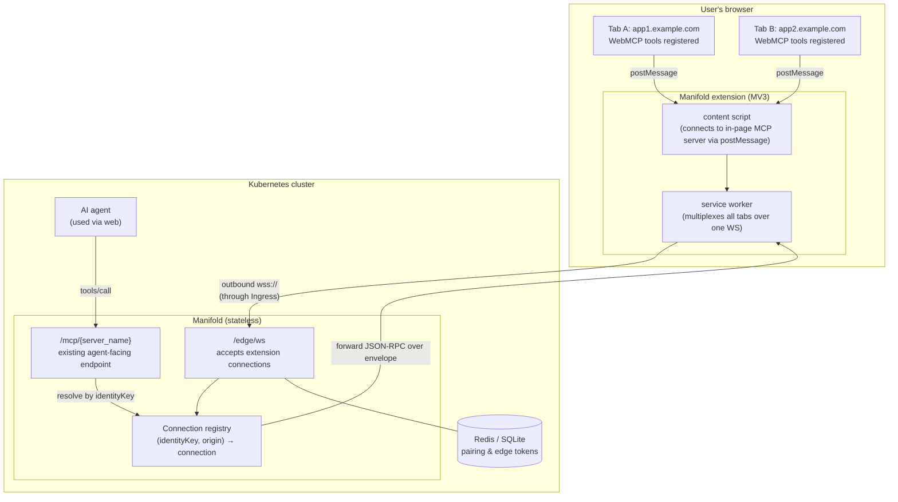
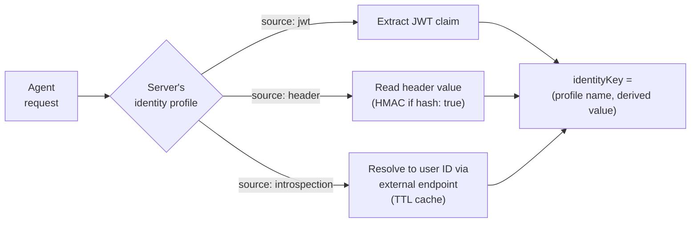
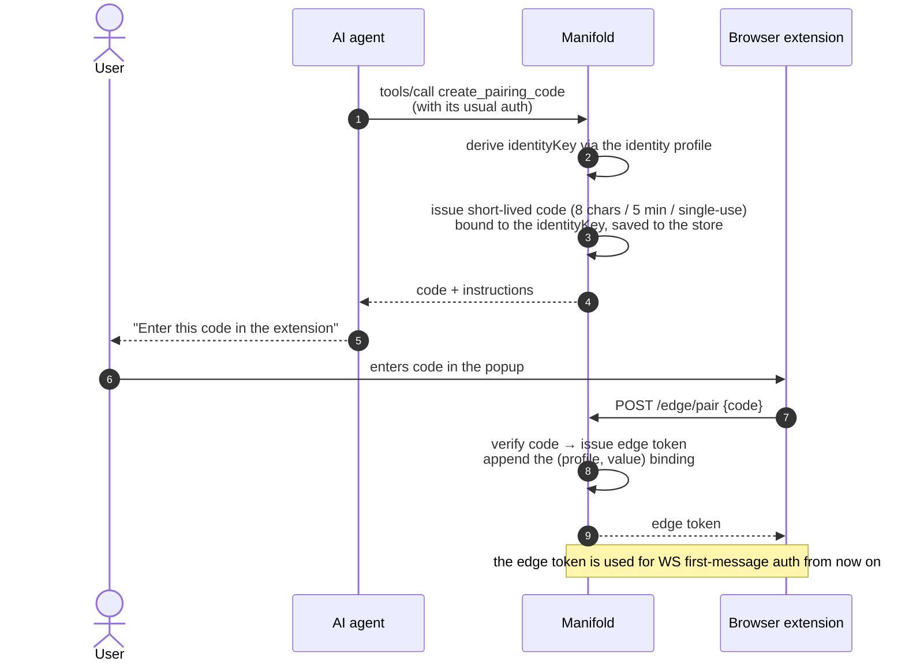
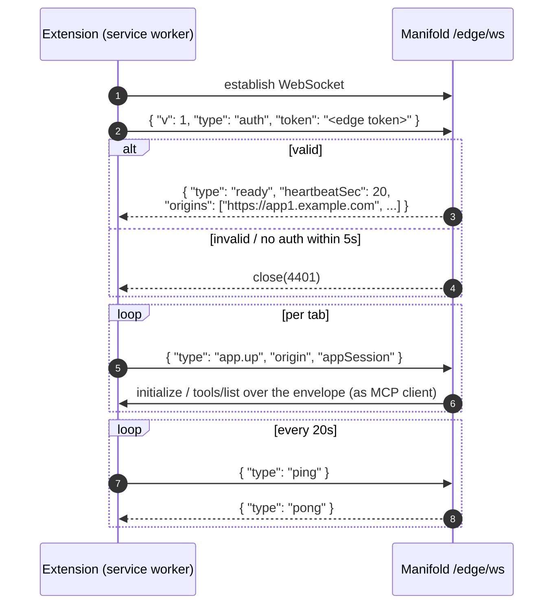
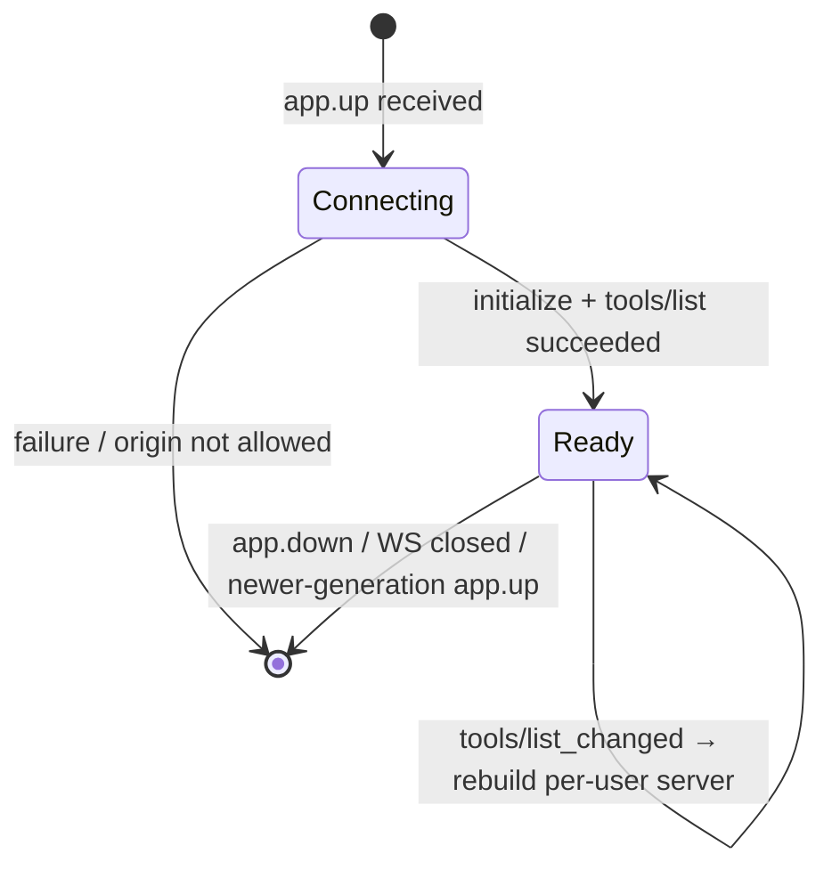
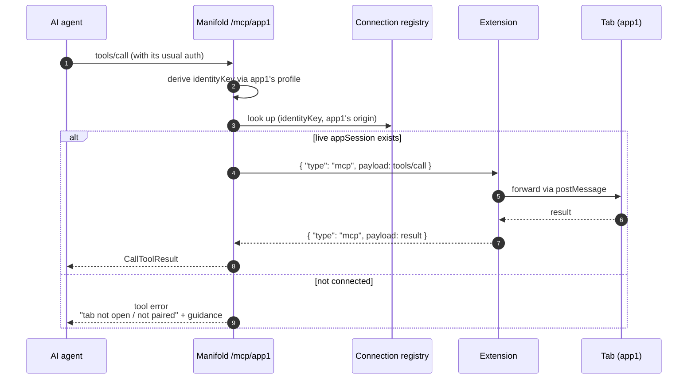

# WebMCP Reverse Connection Gateway Design

English | [日本語](webmcp-reverse-gateway.ja.md)

## Overview

Enable server-side AI agents to call tools that web pages register via [WebMCP](https://webmachinelearning.github.io/webmcp/) (`document.modelContext`; `navigator.modelContext` is a deprecated alias), routed through Manifold.

WebMCP tools live inside the user's browser tab — the JS runtime of a web app the user is logged into. Since the server cannot connect into a tab, **a browser extension opens an outbound WebSocket to Manifold, and the roles are inverted on that established channel** (the page acts as the MCP server, Manifold as the MCP client). We call this the reverse connection.



The direction in which the connection is established (browser → Manifold) is independent of the MCP roles (page = server, Manifold = client). The agent never talks to the browser directly; it always goes through Manifold as the rendezvous point, so where the agent runs (inside k8s or locally) does not affect this scheme.

## Design decisions

| Topic | Decision | Rationale |
| --- | --- | --- |
| How to reach the tools | Reverse connection via a browser extension | As OSS, support any site implementing WebMCP without requiring site owners to add JS. Avoids operating server-side Chrome fleets entirely (per-user process management, credential injection into target apps) |
| App identification | Per origin, explicitly declared in config | Doubles as an allowlist; keeps agent-facing server names stable |
| User identification | Identity profiles (referenced per server) | Agent → Manifold auth differs per deployment and per server (built-in OAuth 2.1 / shared API key + user header / per-user API key) |
| Binding the extension | Selectable edge auth mode (`pairing` / `forwardAuth`) | The default pairing-code flow is independent of the agent's auth scheme. Where fronting auth infrastructure exists (Traefik forwardAuth / ALB + Cognito, etc.), the forwardAuth mode reuses the agent's authenticated cookie and skips pairing entirely |
| Constraint | Tools are callable only while the app's tab is open | Accepted as a spec-level constraint. When disconnected, return an error the agent can relay to the user |

## User identification (identity profiles)

Because agent → Manifold auth differs per deployment and per server, "how to derive who this request belongs to" is defined as named profiles, referenced by each reverse server. Implementing identities profiles is Phase 2a scope (see the [next-phase plan](webmcp-reverse-gateway-phase2.ja.md), Japanese only); Phase 1 (static) does not use them.

The identityKey is the tuple **(profile name, derived value)**. It must satisfy two properties:

1. **Unique per user**
2. **Stable across credential rotation**

The existing JWT middleware on `/mcp/{server_name}` is an intentional **pass-through** (it only checks that a non-empty Bearer header exists); token verification is the responsibility of the backend API / MCP server. With reverse there is no backend to forward the token to — **Manifold is the terminal verifier** — so the `jwt` profile requires Manifold itself to verify signatures (issuer / JWKS / audience). For reverse servers under `pairing.type: static`, even the pass-through Bearer-presence check is meaningless without a forwarding target, so the JWT middleware is not applied at all.

```yaml
identities:
  oauth:
    source: jwt
    claim: sub                  # tokens are short-lived but sub is stable
    issuer: https://idp.example.com
    jwksURL: https://idp.example.com/.well-known/jwks.json
    audience: manifold          # optional
  sharedKeyUser:
    source: header
    header: X-User-Id           # the user ID itself
  rotatingKey:
    source: introspection       # for rotating opaque keys
    url: https://agent-platform.example.com/introspect
    credentialHeader: X-Api-Key
    cacheTTL: 5m
  personalKey:
    source: header
    header: X-Api-Key
    hash: true                  # use an HMAC as the key; never store the raw value
```

| source | Derivation | Rotation tolerance |
| --- | --- | --- |
| `jwt` | The given claim (default `sub`) of the Bearer JWT, **after signature verification (issuer / JWKS / audience)** | Yes (claim stays stable across token renewal) |
| `header` | The value of the given header; `hash: true` applies an HMAC | Only if the header value is stable. `hash: true` is for non-rotating keys only |
| `introspection` | Resolve the given header's value to a stable user ID via an external endpoint (TTL-cached) | Yes (the resolved ID is stable) |



### Unsupported configuration

If the only credential is a rotating opaque key, no stable identifier exists anywhere in the request, and no introspection endpoint can be provided, correlation is fundamentally impossible and is out of scope (no design can solve it).

### Trust boundary

With `source: header` (the `X-User-Id` pattern), trust stops at "anyone holding the shared API key can claim any user ID." Manifold cannot verify this; it trusts the agent platform to set the header correctly. This constraint is documented for operators.

## Binding the extension to an identity (edge auth modes)

There are two modes for binding an extension connection to an identityKey, selected per deployment in config.

| Mode | Intended environment | Binding mechanism |
| --- | --- | --- |
| `pairing` + `type: remote` (default) | Multi-user, no fronting auth | A pairing code issues an edge token bound to a key derived via identity profiles, used for first-message auth |
| `pairing` + `type: static` | Local, single user (CLI agents such as Claude Code / Codex) | The identityKey is a fixed value, but the pairing step and edge token are never skipped (no zero-config connection path) |
| `forwardAuth` | Multi-user + fronting auth infrastructure (Traefik forwardAuth / oauth2-proxy / ALB + Cognito / Cloudflare Access, etc.) protecting the edge endpoint | The fronting layer validates the agent's authenticated cookie carried by the WS handshake and converts it into an identity header / JWT before forwarding to Manifold. No pairing needed |

In every mode, an extension WS connection is **never accepted unauthenticated** (pairing variants require an edge token; forwardAuth requires a handshake authenticated by the fronting layer).

### pairing mode

The extension does not know the agent's auth scheme. Identity is inherited into the extension through the agent's **already-authenticated channel** (the same idea as the Device Authorization Grant).



- `create_pairing_code` is a built-in tool on each reverse server. It derives the identityKey using **that server's profile** at call time and binds the code to it
- An edge token can hold multiple **(profile, value)** bindings. Servers sharing the same profile need only one pairing
- Using a server with a different profile for the first time triggers an additional pairing via the not-paired error flow
- Edge tokens: long-lived, sliding TTL, revocable from the extension (logout) and server-side. Managed in the existing store (Redis / SQLite)
- Codes: short-lived (5 min), single-use, rate-limited

#### type: static (single user)

For local setups where CLI agents such as Claude Code / Codex use Manifold. Their requests may carry neither a JWT nor an API key, leaving nothing for identity profiles to derive from, so the identityKey is a fixed value.

- `create_pairing_code` performs no identity derivation and returns a code bound to the fixed identityKey. The pairing procedure and the edge token requirement are identical to remote
- The `identity` reference on reverse servers is not required (and is ignored if present)
- The JWT middleware is not applied to `/mcp/{name}` requests for reverse servers (there is no pass-through target; CLI agents can connect without an auth header)
- Being single-user, multiple paired extensions are last-wins. Documentation must state this mode must not be used in multi-user environments
- static is local-only: never expose the edge endpoints to a public network. Manifold adds no bind-address warning or validation (listening on 0.0.0.0 is normal inside containers / k8s, so a blanket warning would be a false positive; restricting reachability is the deployment's responsibility)

### forwardAuth mode

The edge endpoint is placed **under the domain the agent already serves** (e.g. `wss://agent.example.com/edge/ws`, proxied to Manifold). The WS handshake is a plain HTTP GET, so the agent's authenticated cookie held by the user's browser rides along automatically. The fronting auth layer validates the cookie and converts it into an identity header / JWT before forwarding to Manifold.

```mermaid
sequenceDiagram
    autonumber
    participant Ext as Extension (service worker)
    participant FA as Fronting auth<br/>(Traefik forwardAuth / ALB+Cognito, etc.)
    participant M as Manifold /edge/ws

    Ext->>FA: wss://agent.example.com/edge/ws<br/>(agent's authenticated cookie attached automatically)
    FA->>FA: validate cookie
    alt valid session
        FA->>M: forward handshake<br/>(inject identity header / JWT; strip client-supplied ones)
        M->>M: derive identityKey from handshake headers<br/>via the configured identity profiles
        M-->>Ext: { "type": "ready", ... }
    else invalid
        FA-->>Ext: 401 / redirect to login
    end
```

- Derivation uses the **same identity profiles** (`jwt` / `header`) as agent-side requests, so identityKeys match automatically — no pairing, no edge token
- The `auth` frame is still sent but `token` may be omitted (the handshake is already authenticated). Bindings are derived at handshake time for each profile listed in `edge.identities`
- The extension must allow configuring the edge URL per deployment, and needs `host_permissions` for the agent's domain so SameSite cookies are attached to the handshake
- **Trust boundary**: Manifold trusts identity headers only on requests from the fronting proxy. The proxy must strip client-supplied headers of the same names (the standard forwardAuth caveat), and direct access to the edge endpoint must be blocked by network policy

## Edge WebSocket protocol

### Connection establishment and auth

The browser WebSocket API cannot set arbitrary headers, so **first-message auth** is used (tokens never appear in the query string). The `token` field of the `auth` frame is required only in pairing mode; in forwardAuth mode it may be omitted because identity has already been derived from the handshake headers.



The `origins` list sent in `ready` is the set of reverse origins declared in config. The extension activates the bridge only on tabs of those origins (the server also re-validates the origin of every `app.up`; client claims are never trusted).

The heartbeat interval is 20 seconds. MV3 service workers may be suspended after roughly 30 seconds without WS messages, so an interval below 30 seconds is mandatory as a keepalive.

### Frames

| Frame | Direction | Content |
| --- | --- | --- |
| `auth` | ext → M | First frame; `token` carries the edge token |
| `ready` | M → ext | Auth succeeded; `heartbeatSec`, `origins` (allowlist) |
| `app.up` | ext → M | Tab connected and in-page MCP server initialized; `origin`, `appSession` |
| `app.down` | ext → M | Tab closed / reloaded |
| `mcp` | both | `origin`, `appSession`, `payload` (raw MCP JSON-RPC, passed through untouched) |
| `ping` / `pong` | both | Heartbeat |
| `error` | M → ext | Protocol error notice (e.g. non-allowlisted origin); connection stays open |

### App session lifecycle

`appSession` is a UUID (`google/uuid`) per tab-connection generation; a reload starts a new generation.



- For the same (identityKey, origin), **the latest `app.up` wins**; responses addressed to an old generation are discarded
- When a new WS connection for the same identityKey appears (another browser, etc.), last-wins applies per binding as well
- On WS close, all appSessions of that connection are marked down and in-flight calls resolve with an error

### Reconnection

The extension reconnects with exponential backoff (1s → capped at 30s, with jitter), re-authenticates, and re-announces `app.up` for every open tab. The server treats the new connection as authoritative and replaces old state.

## Tool call flow



### Per-user tool serving

WebMCP tools may differ per user and per tab generation depending on page state, so a reverse server's `mcp.Server` cannot be a shared singleton.

- The connection registry holds, per (identityKey, origin), the `mcp.ClientSession` connected over a custom `mcp.Transport` on the envelope, and a **per-user `mcp.Server`** built from its `tools/list`
- The `StreamableHTTPHandler` server-resolution function, for reverse backends, derives the identityKey from the request and returns the per-user server from the registry
- A `tools/list_changed` notification rebuilds that user's server
- The existing `MCPBackendClient.registerTools` (whose closure captures a session) is not reused; tool registration and call-target session resolution are split into a shared helper

## Configuration

```yaml
identities:
  oauth:
    source: jwt
    claim: sub

gateway:
  edge:
    auth: pairing            # pairing (default) | forwardAuth
    pairing:
      type: remote           # remote (default) | static
    # for forwardAuth: profiles to derive from the handshake
    # identities: [oauth]

mcpServer:
  app1:
    description: App1 WebMCP tools
    transport: reverse
    origin: https://app1.example.com
    identity: oauth
    callTimeout: 60s   # optional; default 60s
```

Validation:

- Add `reverse` to the `transport` enum
- With `reverse`, `origin` is required: scheme + host (+ port) only, no path; normalized, and unique across all servers
- With `reverse`, an `identity` profile reference is required (may be omitted if a single global default is configured); referenced profiles must exist. Not required when `edge.pairing.type: static`
- With `reverse`, setting `authValue` / `oauth2` / `tokenExchange` / `command` / `url` is a configuration error (backend auth is carried by the page's own session)

## Error taxonomy

| Situation | Returned to the agent |
| --- | --- |
| Tab not connected (no `app.up`) | Tool error: "The app tab is not open. Ask the user to open {origin} and keep the tab open." |
| Not paired (pairing mode only) | Tool error: "Call `create_pairing_code` and relay the code to the user." |
| Call timeout | Tool error (`callTimeout`, default 60s) |
| Tab closed / generation replaced mid-call | Tool error (connection lost) |
| `app.up` for an origin not in config | `error` frame over WS, ignored; connection stays open |
| Edge token auth failure | WS close(4401) |

The tab-not-connected and not-paired messages are phrased so the agent can relay them to the user as-is.

## Security

- **Origin allowlist**: only origins declared in config are bridged; validated on both the extension and the server
- **User isolation**: every registry lookup key includes the identityKey; there is no path to another user's connection
- **Token handling**: edge tokens are sent via first-message auth, never in query strings. Raw values under `hash: true` are never stored. Edge tokens and pairing codes live in the existing store and are revocable
- **Opaque to the page**: agent credentials are never forwarded to the page. Page tools run under the page's own session (cookies, etc.)
- **Rate and size limits**: caps on pairing-code exchange attempts, WS frame size, and per-connection message rate

## Out of scope for v1

- **Cross-replica forwarding**: v1 assumes a single replica or per-user sticky LB, documented explicitly. Phase 3 records "identityKey → owning replica" in Redis and adds internal forwarding from non-owning replicas (the registry is defined as an interface; the in-memory implementation is later swappable for a Redis-backed one)
- **MCP features beyond tools**: resources / prompts / sampling / elicitation
- **Concurrent multi-browser use**: multiple connections for the same identityKey are last-wins

## Implementation phases

| Phase | Content | Location |
| --- | --- | --- |
| Phase 1 | Config (`transport: reverse` / identities), connection registry, `/edge/ws`, pairing, custom `mcp.Transport`, per-user server resolution | This repository (Go) |
| Phase 2 | MV3 extension. Page connection reuses [@mcp-b/transports](https://github.com/WebMCP-org/npm-packages); new code is limited to the remote WS relay and the pairing UI | Separate repository (recommended) or `tools/extension/` |
| Phase 3 | Cross-replica forwarding (Redis ownership map + internal proxy) | This repository (Go) |

### Go-side layering (Phase 1)

| Layer | Content |
| --- | --- |
| `pkg/config` | `transport: reverse`, `identities` profiles, validation |
| `pkg/domain` | EdgeRegistry interface, state model for (identityKey, origin, appSession) |
| `pkg/services` | Registry implementation (in-memory for v1), pairing & edge token management |
| `pkg/interfaces/http` | `/edge/ws` (upgrade, first-message auth, heartbeat), `/edge/pair` |
| `pkg/internal/mcpsrv` | Custom `mcp.Transport` for the envelope, per-user server construction, server-resolution extension |

The server-side WebSocket library is [coder/websocket](https://github.com/coder/websocket) (context-based API, `net/http` integration, actively maintained). UUIDs use the existing `google/uuid` dependency.
